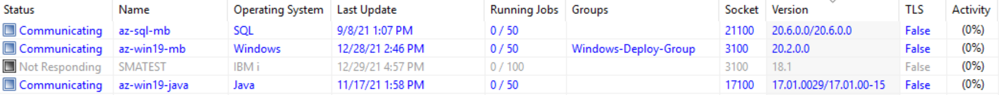
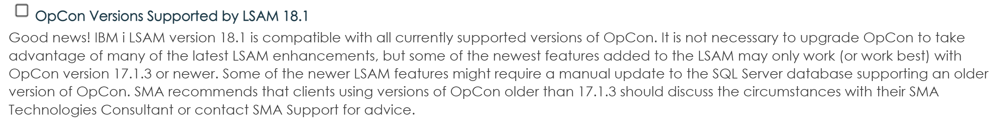

## Agent Compatibility with OpCon

This article is about the compatibility between Agents (Windows, Unix, SAP, IBM i, etc.) and OpCon.

### Compatibility OpCon / LSAM :

OpCon and LSAM versions are **decorrelated**, so it's not necessary to have the LSAM version to **match** OpCon server version.
For example, I'm currently running an OpCon 21 version with LSAM 17, 18 or 20:

No problem in both directions :
 
* You can have an OpCon 21 with LSAM on version 17
* You can have an OpCon 18 with LSAM on version 21

This means that even with an *older* version of OpCon you can benefit from the *latest* updates and patches of LSAM.
However, if you're running an old OpCon version with the latest version of an LSAM, you may not have access to all the features provided by the LSAM.

### To go further :

You can check the LSAM documentation before an installation/upgrade and see if there are any **prerequisites** regarding the OpCon version. 

Example with IBM i LSAM documentation:

