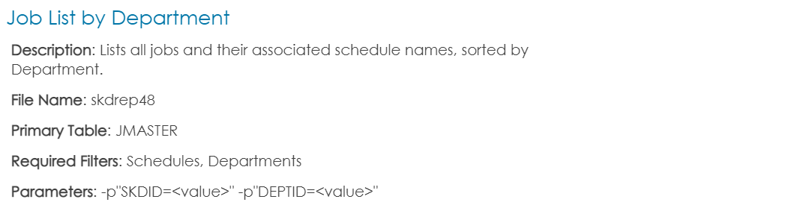
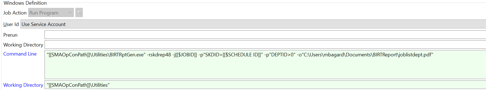
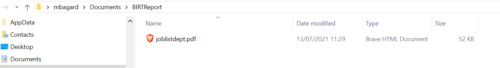
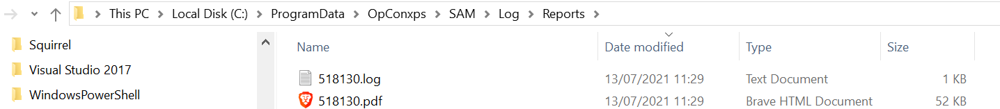

## Automate a BIRT Report

This is a walk-through to help you automate your BIRT reports.

BIRT Report is a tool installed with OpCon allowing you to generate predefined reports directly from the Enterprise Manager with the GUI or by creating a job to schedule a report. In this article, we'll focus on the automation of a BIRT Report with a Windows job.

**The report you need**

Before creating the job, you first need to define what you need and what kind of information you're looking for in your report. SMA is providing a huge list of predefined reports you can find in the online documentation below:

[Documentation for Predefined Reports](https://help.smatechnologies.com/opcon/core/reports/predefined)

Once you've selected the appropriate report, we can go to the next step. For this example, we'll select the following report:

The documentation provide all the information you need to create the job such as the **report reference (name)** and the **required parameters**.
Job creation :
In this step we create a simple Windows jobs with the command line to call the report (**skdrep48**) we've selected in the first step:

* "`[[SMAOpConPath]]\Utilities\BIRTRptGen.exe`": this is where is located `BIRTRptGen.exe`
* `-rskdrep48`: `-r` means the report and **skdrep48** is the code for the report "job list by department"
* -`j[[$JOBID]] -p"SKDID=[[$SCHEDULE ID]]" -p"DEPTID>0"` are the requested parameters for this report
* `-o"C:\Users\mbagard\Documents\BIRTReport\joblistdept.pdf"` is not mandatory but allow you to redirect the report either to a chosen repository or to an email address.
* `-t` allows you to define the format of the report : HTML, XLS or PDF (bypassed if `-o` is redirecting to a file with extension (like joblistdept.pdf). See the conditions on the online documentation.

For more information about BIRT and parameters: [Documentation for BIRT](https://help.smatechnologies.com/opcon/core/utilities/Command-line-Utilities/BIRT-Report-Generator)

**The report**

If you've defined a specific folder for your report like in the previous example, the report is generated in the folder.

If you don't set a specific folder through the "-o" parameter, the report is generated by default in your **SAM/Log/Reports** folder. You'll by the way find here the log created by Birt for each report.

