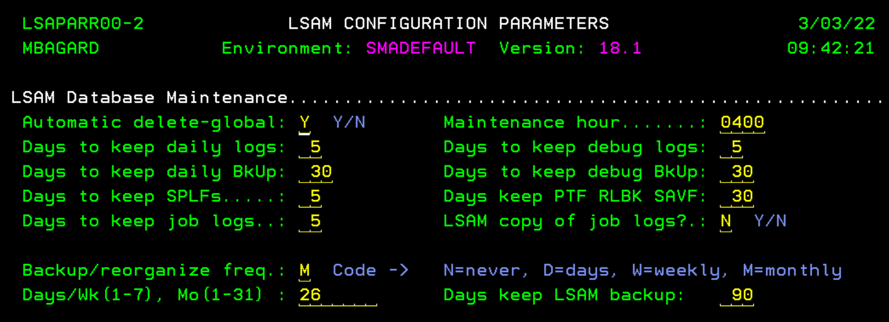
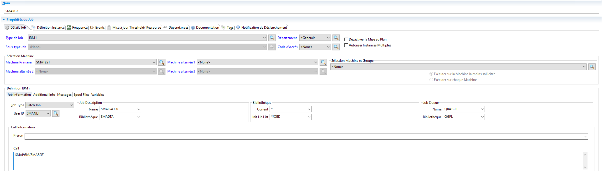

## Automate IBMi Backup/Reorganize Job

This article will provide you the information needed to automate the backup/reorganize maintenance job of the IBM i LSAM (SMARGZ)

**What is the General LSAM Database Maintenance (SMARGZ)?**

The LSAM utility command **SMARGZ** is used to perform the following maintenance functions:

* Complete a full backup of the library SMADTA (uses the **SMASUP** command in **LIB** mode).
* Reorganize all the physical data files in library **SMADTA** to recover disk space from deleted records.
* Delete aged save files from the library **SMALOG**.

**Automatic execution by the LSAM:**

The **SMARGZ** execution is generally handled by the LSAM. You can access the configuration screen from the LSAM Main Menu > Option 7 "LSAM parameters" > Second page:

The **SMARGZ** execution is managed by this part where you can define if you want the LSAM to execute the backup/reorganization Never, Daily, Weekly, Monthly.

"The default settings that allow the LSAM to automatically reorganize database files and delete old save files help to assure that the LSAM will not utilize too much disk space. However, as described above, it may be preferred to set the LSAM Backup/reorganize frequency code to "N" (= never) so that the LSAM does not execute the **SMARGZ** command, and instead define an IBM i job in an OpCon schedule that will execute the **SMARGZ** command. Another reason for this strategy is that the OpCon schedule and job dependencies can determine when is the best time, of least activity, when this type of database maintenance should be performed."

**Automate the SMARGZ in an OpCon job**

In the screenshot below an example of the settings needed to run the **SMARGZ** from an **OpCon** Job.

OpCon job parameters details :

* Job Name = user choice
* Machine = one job for each IBM i LPAR that uses the OpCon LSAM
* IBM i job sub-type = Batch Job
* Batch Job User = must have authority to update files owned by user SMANET. (LSAM files are installed with *PUBLIC authority *REVOKED.)
* Job Description = SMALSAJ00
* Job Description library = SMADTA (or other library name, for an alternate LSAM environment)
* Job Queue (formerly called Batch Queue) = QBATCH
* Job Queue Library = QGPL
* Call command line: SMAPGM/SMARGZ
* The library name SMAPGM would be different for an alternate LSAM environment

:::info Note 

The LSAM operations will be suspended during the execution of the SMARGZ command. The amount of time will vary depending on the speed of the IBM i machine, the percentage of CPU utilization and the amount of files to manage. If the SMARGZ has not worked for a long time, the first time the command will run may take up to hours depending on the volume of files.

:::