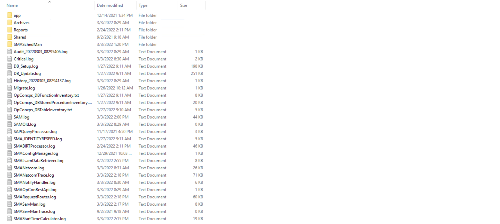
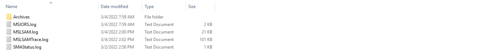
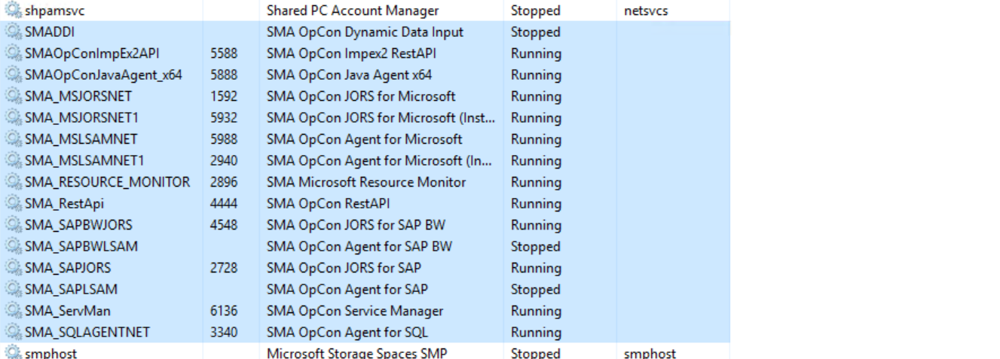
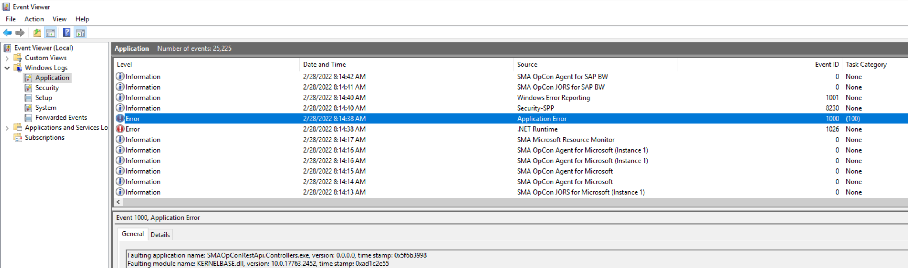

## Basic Troubleshooting Steps

**Introduction to OpCon troubleshooting**

This article is designed to introduce you to the basic troubleshooting of **OpCon**. It will provide you some tips to perform a first analysis of your environment if you encounter some troubles with **OpCon** or an agent based on **Windows**. This article will also provide you some reflexes with **OpCon** and will help you to identify faster what the issue is and eventually how to solve it.

**OpCon log files**

OpCon log files are located under `C:\ProgramData\OpConxps\SAM\Log` if the installation is performed on the `C:` drive . If it's on a different drive, the log files are located under `D:\OpConxps\SAM\Log` for example.

The log files will provide useful information about everything related to OpCon and it's important to start the troubleshooting from here. Every process has it own log file.

**Folders**

* Archives : last 10 days of **OpCon** log files are stored in this folder (default setting).
* Report : generated **BIRT reports** and associated log files are in this folder.
* SMASchedMan : contains every **schedule build or delete** log.

**Files**

* `Critical.log`: this log contains **critical information** about OpCon. If OpCon is not running or is failing, this log may contains useful information.
* `SAM.log`: this log contains all information about **OpCon operations**. If a job is failed, a resource is used, a threshold is updated or an event is triggered, this log will trace the information.
* `SMALsamDataRetriever.log`: this log contains information when a user **retrieves the job output log**. This will display the communication information between OpCon and the LSAM.
* `SMANetCom.log `: this log contains communication information about OpCon and every agent. If you encounter communication issue with an LSAM, this is an important start point.
* `SMANetComTrace.log`: this log is complementary to the previous one. It contains all the communication traces between OpCon and the agents.
*`SMANotifyHandler.log`: contains the log of the process that handles the **notifications** processed by OpCon.
* `SMAOpConRestApi.log`: contains the log generated by the **OpCon API** used in particular by the Solution Manager web interface.
* `SMARequestRouter.log`: contains the log of the processed requests submitted by the SAM and the user interfaces.
* `SMAServMan.log`: log all the information related to the **OpCon processes** status. Important log if one of the process is faulty or to check if everything is running correctly. Also give an information about the mirror if ServMan from both sides are communicating together.
* `SMAStartTimeCalculator.log`: this log contains the information about the process that calculates the estimated start time of the jobs.

**Tips & Tricks**

* The date modified of the log file give a quick information about the state of OpCon. Log files such as **SAM**, **NetComTrace**, **SMAServMan** or **SMAStartTimeCalculator** are updated very often so if the SMAServMan.log or the SAM.log haven't been updated for minutes/hours it indicates that OpCon is no longer running.
* Every log has its own purpose and is linked to its own process making easy to find the information about a component you're looking for.
* The log file you're looking for can be in the Archives folder.

**LSAMs log files**

This is similar to the OpCon log files as they are by default located in the same OpConxps folder. Agents based on Windows (SQL Agent, SAP LSAM, SAP BW LSAM, MSLSAM and Java Agent) share the same structure for the log.

The Archives folder will store most of the time and by default 10 days of log files (it can be modified in the .ini file of the agent). You're more likely to find information in the **agent log** (MSLSAM.log, SAPLSAM.log or SQLAgent.log for example). Some agents have a *JORS.log like the MSJORS.log containing information about Job Output retrieval. The MSLSAM has a SMAStatus.log and SMAFTAgent.log with information about File Arrival and File Transfert jobs.

**Windows Task Manager**

The Task Manager can provide relevant information about your environment system, if the processes are running, what is the consumption of CPU and memory. The Services tab is also useful to display quickly if **OpCon services** are currently running or stopped.

**Tips & Tricks**

* SMA_ServMan is the service handling all the **core processes** of OpCon. It must be always in a running state.
* If OpCon can't communicate with an LSAM, make sure the LSAM service is running.

**Windows Event Viewer**

The Windows Event Viewer is the last step of this basic troubleshooting article. The event viewer provides relevant information especially when there is an issue with a **process** or when a **service** cannot be started. The EV will also display information not directly from **OpCon** but from other **related components** such as SQL Server.

The most important categories in the Event Viewer for troubleshooting are **Application** and **System** and it's often useful to check here to have a better understanding of what happened and when it happened. Moreover, you're likely to find information not available in the OpCon log files.

