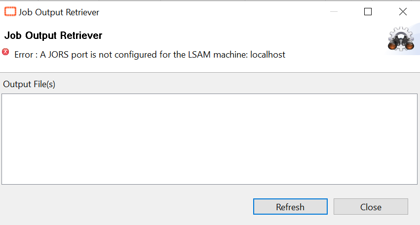
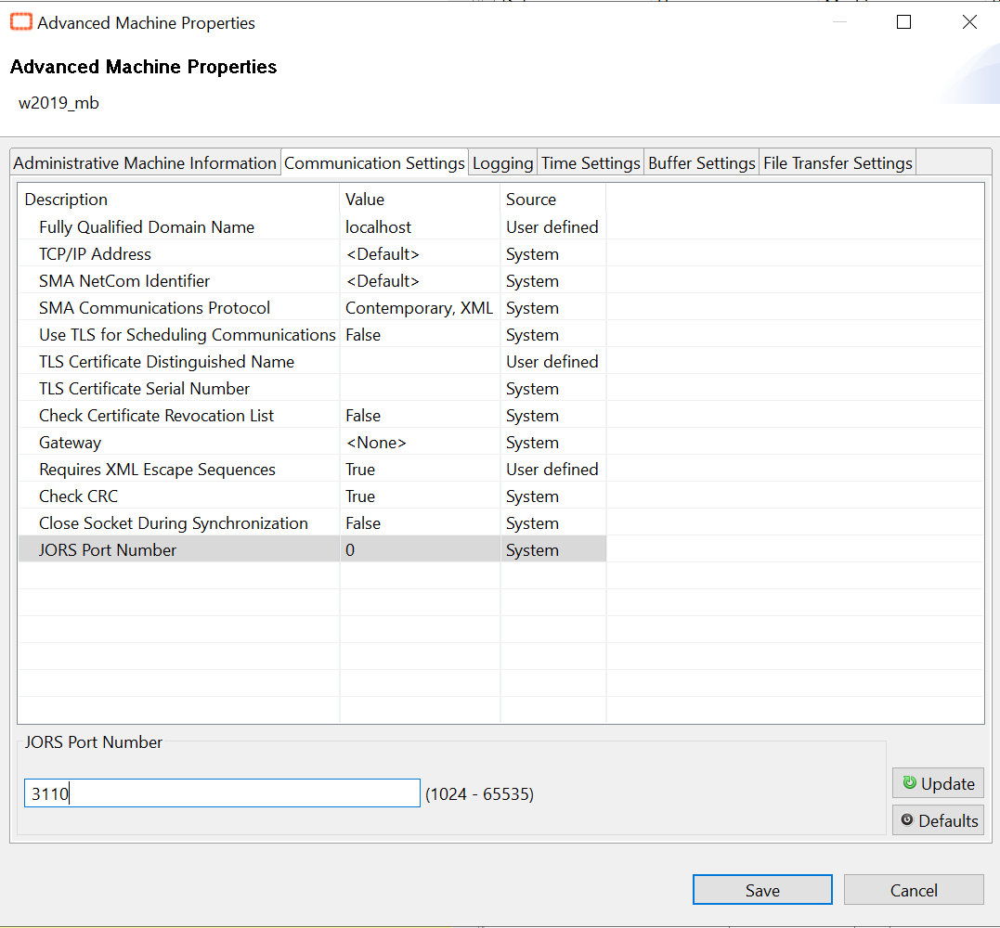
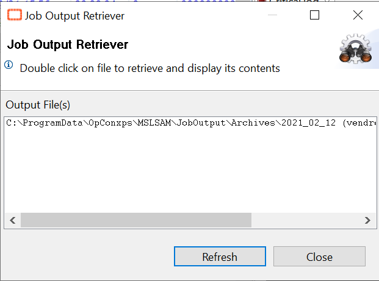

## Cannot Retrieve a Job Log

When SAM attempts to process job starts and receives an arithmetic overflow

**What is the issue?**

When you click on your job and "**View Job Output**", you may encounter a **JORS** error and not be able to retrieve your job log.

If you see this error message, then your machine is not correctly configured. 

**How to solve this?**

It's quick and simple! Just navigate on your **Enterprise Manager** to the **Machines** page, then select your machine. 

For this operation you'll need to **stop the communication** for a short moment, **please make sure that you can briefly cut the communication without impacting your plan!**

Once the communication is stopped, click on **"Open Advanced Settings Panel"** and go to the second tab **"Communication Settings"**. At the bottom of the page, you'll see **"JORS Port Number"**. Just enter on this field the **JORS Port Number** of your LSAM. Usually, the JORS Port is the Communication port of your machine + 10 (e.g., 3100 for the communication, 3110 for the JORS).

Once the modification is done, just save and start the communication with your **LSAM**. 
Now the log is accessible on the Job Output Retriever! 

