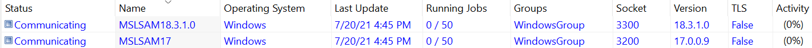
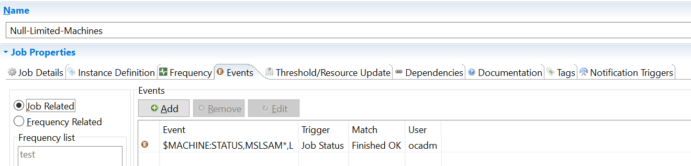
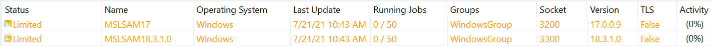
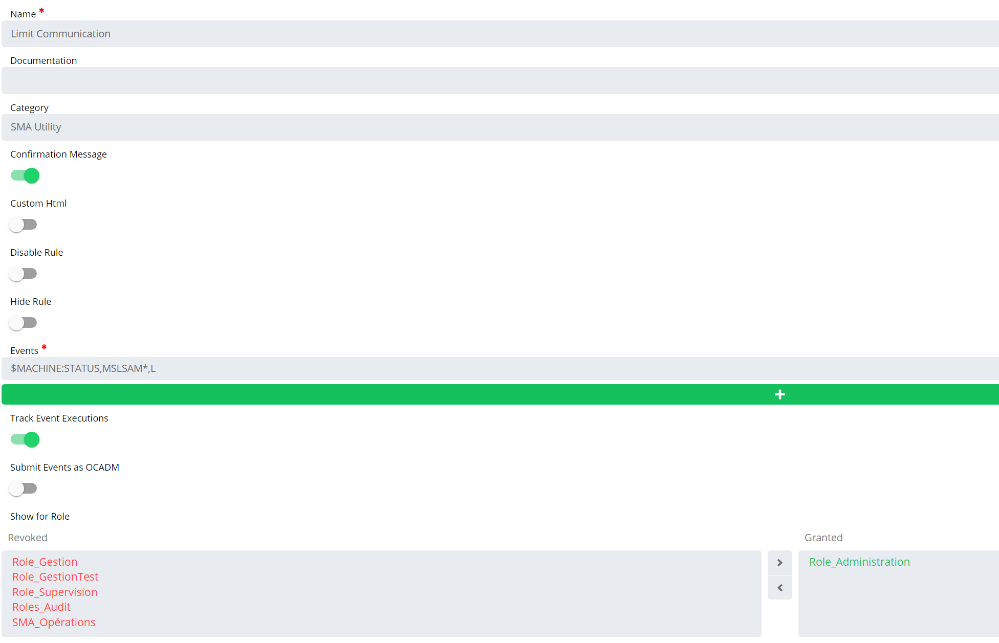

## Change Machine Status With an Event

In this article, we'll learn how-to automate the **status modification** of one or several machines. This is a useful tip when we want to schedule a maintenance time frame where we don't want jobs to start on the agents. Let's take an example to illustrate this.

**Event on null job**

In this example, we've two MSLSAM installed on two different machines where we want to run Windows updates on Saturday 07/24 between 6 and 7 AM.

During the maintenance time frame, we don't want jobs to start on the two agents so we can create a **Null** job that will trigger an **event** when finished ok just before the beginning of the maintenance.

The Null job created only needs one event to change the status: `$MACHINE:STATUS`

This event allows you to set one of the following status:

* `L` for **"Limited"**: the machine is still communicating with OpCon, jobs still running will be completed but nothing is submitted.
* `D` for **"Down"**: the communication is stopped between OpCon and the LSAM.
* `U` for **"Up"**: the communication is up and LSAM and OpCon are communicating.

In the machine name, it's possible to put a single machine or a name with a wildcard to target more machines like in the example above.

In our example, we've put the machines in limited so if jobs are still running they're able to complete and return the completion status to OpCon. But OpCon will not submit anything else until status is back to Up.

Once the maintenance period is complete, we can add another null job to run after the end of the maintenance to put the machines in "U" status to re-establish the communication.

**Self-Service button**

It's possible to create Self-Service **button** to allow defined users to interact with the machines upon request. Below a button performing the same action as the event in the previous example:

