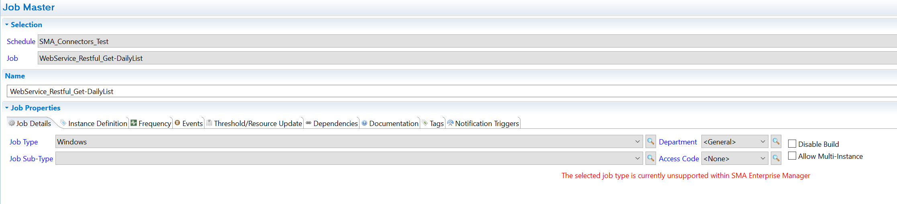
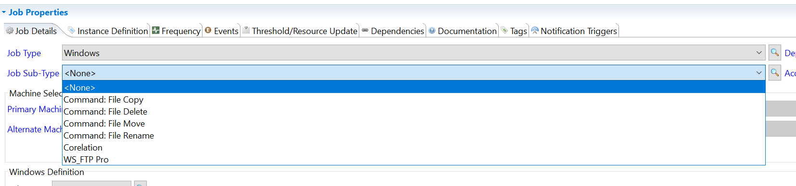
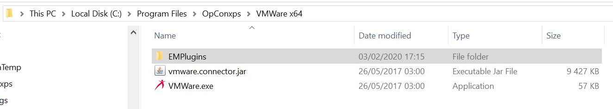
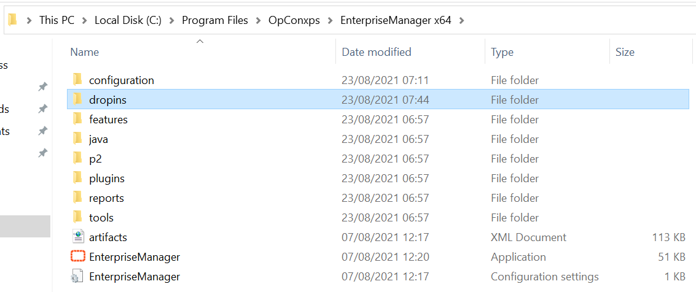
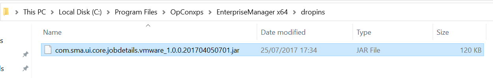
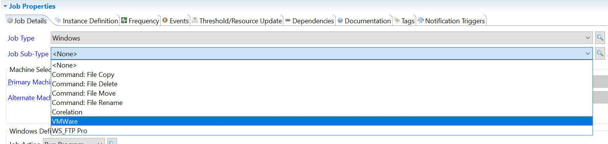

## Connector Sub-Type Not Found In Enterprise Manager

OpCon comes with a great variety of **connectors** such as VMWare, WSUS, Web Services, etc. These connectors allow you to enrich your environment by automating even more tasks.

We will see in this article a common trouble you may encounter if you have missed a step during the install process of your connector or if you're using a fresh install of the Enterprise Manager.

**What is the issue?**

You may encounter this issue if you're trying to access to an existing job using a connector's **Job Sub-Type**.Then the error you're getting is the red message saying "the selected job type is currently unsupported within SMA Enterprise Manager".

The second case where you may encounter this is when you try to create a new job using a connector but you're unable to find the connector's **Job Sub-Type**.

**How to solve it?**

You can't find the Job Sub-Type of your connector because the associated .jar file wasn't dropped in the Enterprise Manager **dropins** folder. Enterprise Manager needs a .jar file to add the job sub-type in the list as it's not recognized by default.

To retrieve the **.jar** file, just navigate to the connector's installation folder:

In the folder, you'll find another folder named **"EMPlugins"**, open this folder to find the .jar file to drop in the Enterprise Manager.

Copy this file and navigate to your Enterprise Manager installation folder.

Go to the **"dropins"** folder and paste the copied .jar file.

Once this operation is completed, just **restart** your Enterprise Manager to load the .jar file. Then you'll be able to see the imported Job Sub-Type.

**Issue with the user rights**

You may encounter a user right issue on the Enterprise Manager that prevent it to load the plugins. Please check that your session has the appropriate rights.