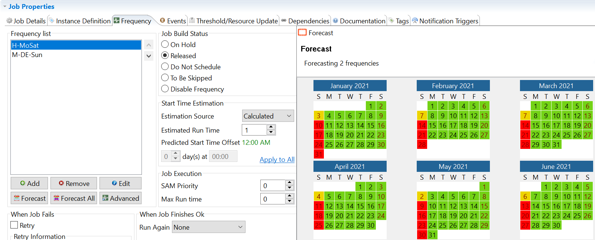
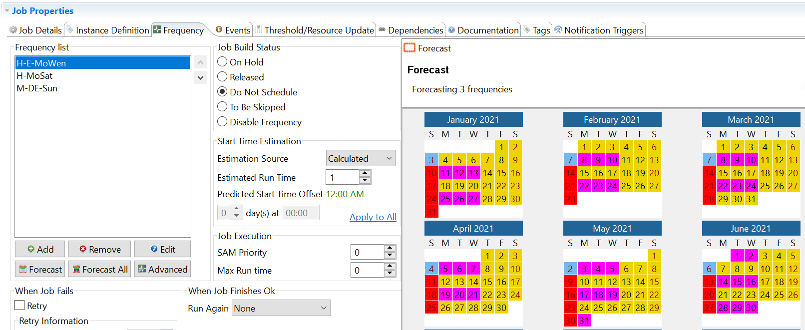
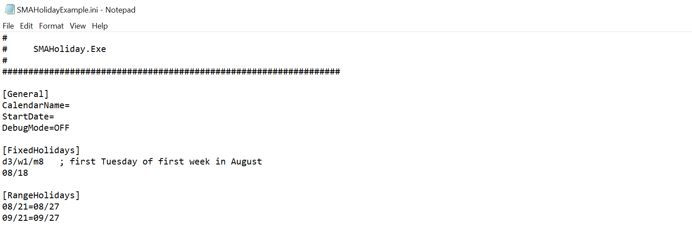
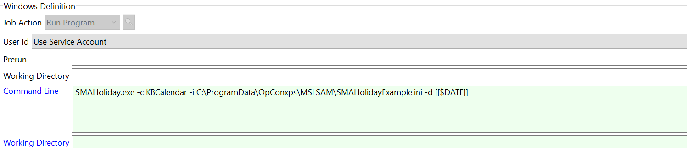
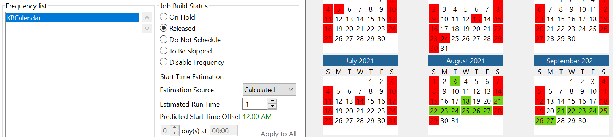
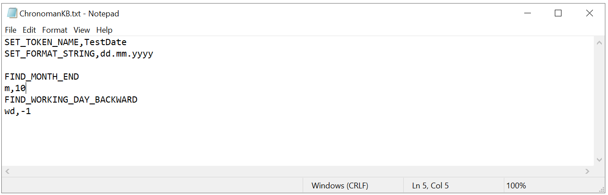
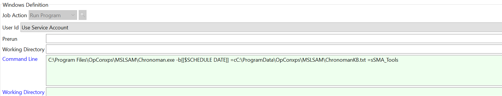
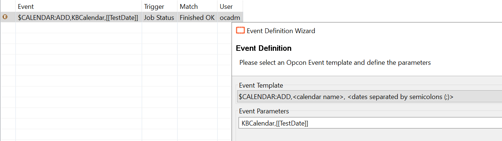
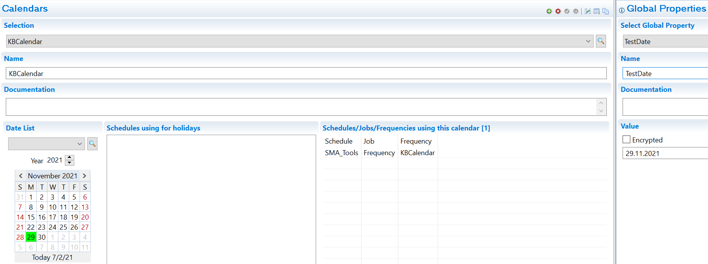

## Create a Complex Frequency

Frequencies are a key element in your automation environment. The core of automation is to plan schedules and jobs and for this purpose you may have to create simple or more sophisticated frequencies. This article is designed to provide you some tips about the construction of a complex frequency through job master frequency tab or by using tools such as **Chronoman** or **SMAHoliday** to build calendar.

*This article is using colors, if you've difficulties to see colors, please refer to the ¹ and ² notes.*

**Multifrequency**

On the job Master **"Frequency"** tab, you can add more than one frequency to build something you're not able to do with a single frequency.

To illustrate this, let's take a first example.

:::tip First Example 

We want to schedule our job all weeks from Monday to Saturday but we also want to schedule the job every first Sunday of the month. By default, this is not something possible with a unique frequency. However, if we split this in two frequencies it's easier so we'll create a first frequency with all weeks from Monday to Saturday and a second one with the first occurrence of Sunday in a month.

Once we're done, let's take a look to the Forecast All:

In green and yellow, the job will run. In red, the job will not be scheduled.¹

¹ *yellow: first Sunday, red: all other Sundays, green: all the remaining days.*

:::

:::tip Second Example 

Let's complicate a little bit more our exercice. We want to do the same thing as in the first example, however we don't want the job to run from Monday to Wednesday on Even weeks. Again, it's not possible to do it in one ore two frequencies so we'll create a new one corresponding to this period.

At the right of the Frequency list box, there are two arrows to move the frequencies up or down. This is intended to hierarchize the priority of the schedule over the other. A frequency on the top will rules over those lower in the list.

In yellow² and blue the days the job will run, in pink and red the days where the job isn't scheduled. What does it mean? According to our frequencies, the job will run every weeks from Monday to Saturday and the first Sunday of the month and to this we substract Monday to Wednesday of even weeks. Please note that this is working because the frequency of the even weeks is set in **"Do not schedule"** and placed on **top** of the other two frequencies.

² *blue: first Sunday, red : all other Sundays, pink: Monday, Tuesday and Wednesday of even weeks, yellow: all other days.*

:::

**SMAHoliday**

SMAHoliday is a tool embedded in the MSLSAM. The main purpose of this tool is to calculate Holidays and fill a calendar with your country or your own non-working days (like Master Holiday calendar). However, this tool can also be used to fill other calendars that can be used to create frequencies.

How does it work? SMAHoliday can be scheduled in a job once a year (early January for example) to calculate your calendar. The tool will read a provided .ini file containing your custom information. Let's take an example.

:::tip Example 

We want to schedule a job to run the first Tuesday of August, on 8th August, from 21th to 27th August and September. This means that we've two fixed days and two ranges. Let's translate this in our .ini file :

It's not mandatory to set the calendar name and the start date here as we can define it in the command line of the job.

:::

Once the job is finished ok, our calendar "KBCalendar" is filled with the date. We can then create a new frequency on "Annual Plan" with this calendar associated and the forecast will be:

As intended, we've in green the 3rd August (1st Tuesday of the month), the 18th August, and the two ranges from 21 to 27th August and September.

:::info Note 

You can use SMAHoliday to create either a working day/period or a non working day/period, it depends of what you're doing with the frequency.

:::

**Chronoman**

Chronoman is also a tool embedded in the MSLSAM like SMAHoliday but its purpose is to calculate a single date following instructions in a .txt file. The purpose of the Chronoman is to calculate a very specific date and fill a Global Property we can use to update a calendar. The main complexity lies in writing the instructions. 

Like before, let's take an example to dig in.

:::tip Example 

We want to run a job the second to last working day in November.

Just like the SMAHoliday, we'll create a job running once a year to update our calendar, let's consider we start it January 1st.

What does it mean:

* `SET_TOKEN_NAME` TestDate`: it's the name of the Global Property we'll fill with the calculated date

* `SET_FORMAT_STRING,dd.mm.yyyy`: it's the format of the date we'll create

* `FIND_MONTH_END`: it means that we're positioning at the end of the month

* `m,10`: it means that where adding 10 months to the actual month we're in : January (01) + 10 = 11 : November

* `FIND_WORKING_DAY_BACKWARD`: will find the first working day backward from the end of the month if we're not already on a working day

* `wd,-1`: it means that we substract one working day to the current calculated date

The job definition:

The event defined on this job will fill the designated calendar with the calculated date:

Once the job is finished ok, our Global Property "TestDate" and our Calendar are completed:

In conclusion, Chronoman is a very powerful tool although more difficult to use but if you need to create a frequency with a specific date it's definitely the tool to use.

:::

**Combination**

Everything we've seen above can be combined using multifrequency allowing you to build complex frequencies to match your scheduling needs.

**To go further**

Please find below links to the **OpCon online documentation** if you want to get more information about the possibilities and usage of these tools.

* [Frequencies](https://help.smatechnologies.com/opcon/core/job-components/frequency)
* [SMAHoliday](https://help.smatechnologies.com/opcon/core/utilities/Command-line-Utilities/SMAHoliday)
* [Chronoman](https://help.smatechnologies.com/opcon/core/utilities/Command-line-Utilities/Chronoman)