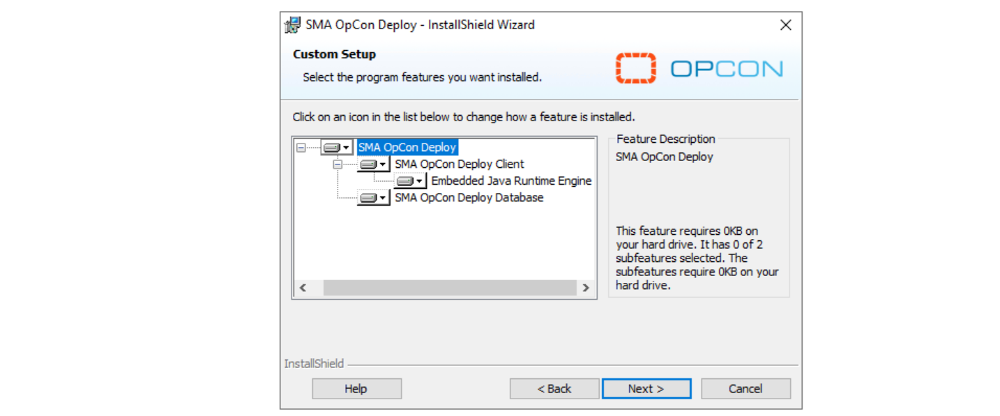

## Deploy Installation/Upgrade

This article will provide you guidelines to install or upgrade confidently your Deploy environment.

**Requirements**

* Operating System: Support for Windows Server 2012, 2012 R2, 2016, and 2019
* Java: Embedded OpenJDK 11
* Microsoft SQL Server version 2012 SP3 or higher
* OpCon Server version 18.3 minimum
* OpCon RestAPI must be active for each OpCon system participating in OpCon Deploy
* To use the Diagram feature, the open source software Graphviz (version 2.38), is required. This can be downloaded from [www.graphviz.org](www.graphviz.org).

**ImpEx2** 

Since the following OpCon Versions (see list below), Deploy's ImpEx2 server **component** now has its own installer and is available with the **OpCon package**. This makes it easy to upgrade ImpEx2 only when needed without having to upgrade OpCon or Deploy client. It also makes it easy to upgrade Deploy client without upgrading ImpEx2 or OpCon. A new ImpEx2 installer is available at each new OpCon release.

* 18.3.9
* 19.0.7
* 19.1.8
* 20.2.0 (STS)
* 20.0.3 (LTS)

Deploy installer now only contains two components: **Client** and **Database**.

**Installation / Upgrade specificities**

* An upgrade of the Deploy Database is **mandatory** when a Deploy Client upgrade is performed.
* If an upgrade of ImpEx2 is needed, you need to upgrade the ImpEx2 on all environments.
* It's possible to upgrade Client/Database without an upgrade of the ImpEx2.
* It's possible to install the last Deploy version available as long as ImpEx2 module is **matching** its OpCon version :
* For example, you can have an OpCon with its ImpEx2 in version 18.3.11 and install Deploy Client and Database in version 20.7.0.
* It's possible to install an ImpEx2 version **superior** to OpCon version as long as they share **major** version number :
* For example, you can have OpCon **19.1**.7 with ImpEx **19.1**.12 and a Deploy Client and Database **20.7**.0.
* You can't have OpCon **19.0**.7 with ImpEx **19.1**.12 because OpCon isn't in a **19.1.x** version
* You can't have OpCon **20.0**.7 (LTS) with ImpEx **20.7**.0