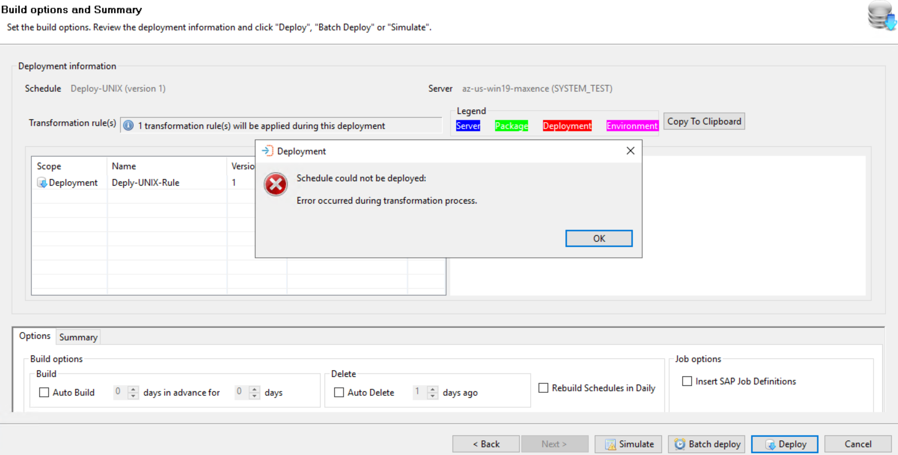
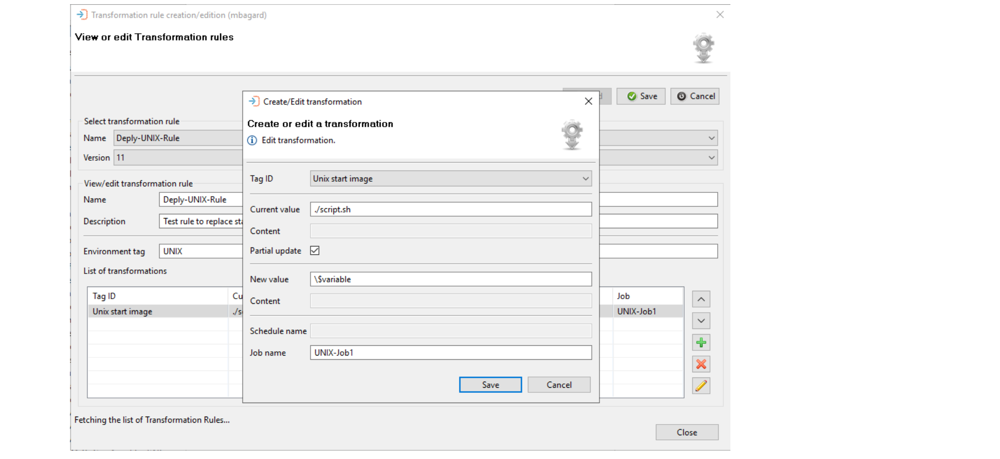
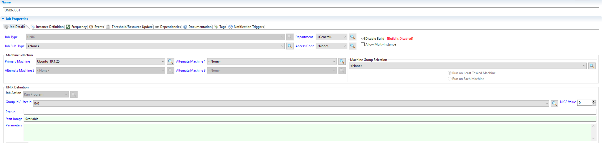

## Deploy Transformation Rule UNIX Start Image

**What is the issue?**

If a **transformation rule** is created to replace/modify the start image of a **UNIX** Job to use a variable starting by a "$" character, you'll encounter an issue at the deployment of the schedule on your target environment as the character is not escaped.

**How to solve it?**

The solution here is to prefix your `$variable` by a **backslash** in order to escape it correctly:

The backslash disappears after deployment:

