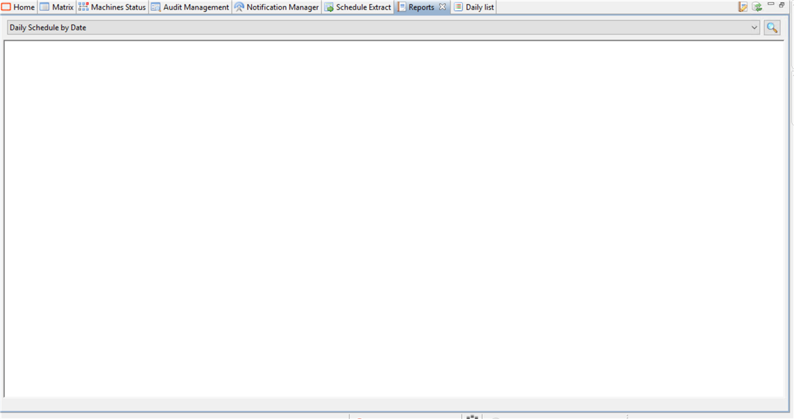

## Enterprise Manager Report Takes Too Much Time to Load

You try to display the **"Reports"** page on your **Enterprise Manager** and you are stuck with a blank page after several minutes:

**How Enterprise Manager works with the reports**

**Enterprise Manager** uses the Eclipse RCP framework behind the scene to run the app. EM is only made of plugins, that are dynamically loaded on demand when a plugin is opened. The Eclipse RCP framework use a plugins mechanism named OSGi to load plugins (JARs) - this controlled by the framework and EM have no control on it.

When a plugin is loaded it means the JAR (which is an archive file, like a zip) is dynamically extracted in-memory (and some part may be extracted on the disk as well) for usage. When this happens, anything that filters I/O (e.g. virus protection softwares) slow things down, then how slow it is relative the software that filters for analysis.

**What are the solutions?**

**BIRT Report Viewer** plugins in **EM** is relatively heavy, so the plugin loading might be slow in case every file dynamically extracted is analyzed by an external program (e.g. virus protection). In case this is too slow, two options :

1. Disable the **virus protection**. It will run smoothly and prove where the slowness comes from.

2. Tweak the software that filters I/O to avoid **EM** or the part that makes it slow to run. The tuning part has to be made by the system admins that setup the program that filters I/O since we don't know it and they all have different options and operational specificities. Maybe **excluding from real-time analysis** the **EM** folder from the program that filters I/O might resolve the issue. For fine-grained tuning, an analysis of what the virus protection or I/O filter program does is required, which is not of our responsibility but the software vendor support.
