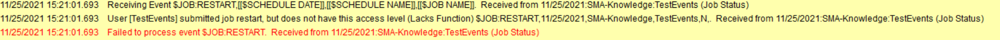

## Event Associated to a User

In the **Enterprise Manager**, every users with the appropriates rights and privileges granted through **roles** can create new schedules, jobs or events. The question that may arise is, what happens if a user changes role or is deleted ? We will see in this article the best practices to answer these questions and avoid any questions.

**If you delete the user account**

When you delete a user account on the Enterprise Manager, you'll not encounter any side effects on the content created by the user. The main interrogation can be on the event that are directly linked to the user but **OpCon** reassigns all the events created by this user to ocadm account.

**If you change the role of a user**

If the user is moving to another department or position and need **less rights** in OpCon, you may change his user to a role with **less privileges**. This may cause some disruption in OpCon with the events as they're directly tied to the user who created them.

For example, I created a `$JOB:RESTART` event with a test user who had **role_ocadm**. I then removed the role_ocadm to this user and my event isn't successfully completed as the user associated no longer possess the privileges on the schedule and the job:

In this case, you can reattribute the right to the user or you can delete the user and recreate it. By doing this, OpCon will reattribute the event to **ocadm** and if you recreate your user you'll no longer have any link with the previous events.

**Best Practices**

The best practice to avoid any issues is to delete the user account and to recreate it with the new rights so the user will no longer be linked to the content as it will be reassigned to **ocadm**.