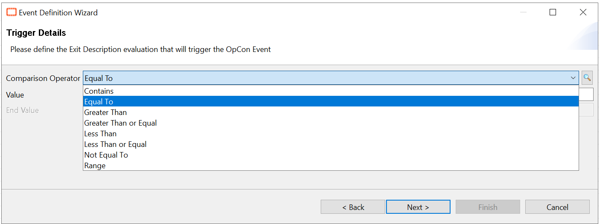
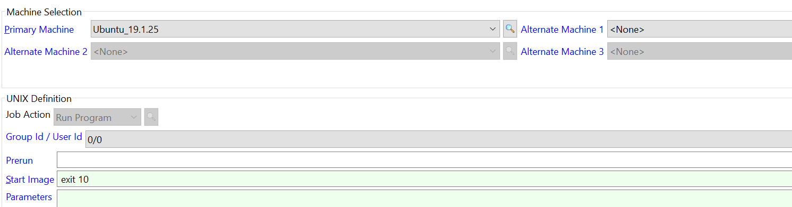
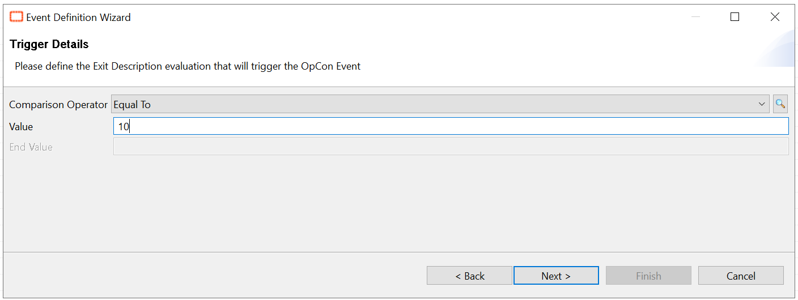
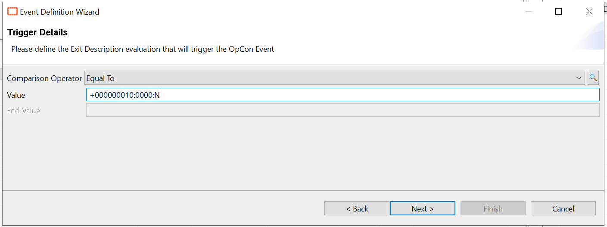
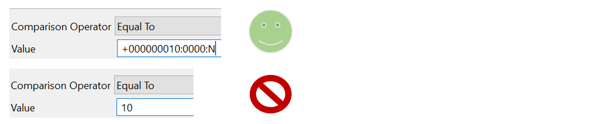
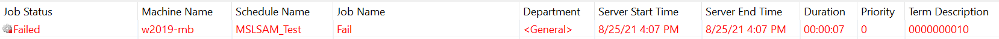
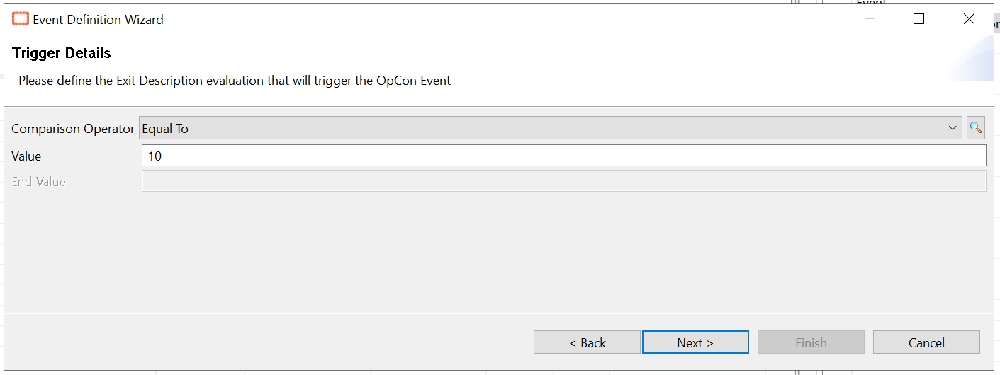

## Exit Description Event Trigger Not Working

**Events** are strings that execute commands within OpCon. Events can be defined to execute upon Schedule Completion, Job Statuses, String Match on LSAM Feedback for Jobs, Job Exit Description, Event Triggers from the Notification Manager, and external events. These events cause the SAM to take a number of different actions.

In this article, we'll focus on the **"Exit Description"** trigger type. This trigger allows you to compare the Exit code of your job to a defined value using one of the comparison operators available:



**What's the issue?**

The issue here is the exit don't trigger the event you've set, but let's take an example to illustrate this.
I created a really simple **UNIX** job which has for only function to end with exit code 10:



Then, we want to catch this exit code 10 to trigger an event, we make it as easily as possible:



Once we've create the event we want, we can try the job and the event:


The job is **"Failed"** with exit code 10, but the event isn't triggered.

**What happened and how to solve it?**

The reason here is simple : the job return a more complex description: "`+000000010:0000:N`"

Then you must use the complete Term Description returned by the job such as:



To conclude, put the complete exit description returned by your job to avoid any trigger issue.



**Windows Job Term Description**

The behavior is different with Windows Job, the exit code is 10 but the full Term Description contains "0" so the complete Term Description is "```0000000010```".



However, it does work to use only "10" in the trigger for a Windows Job:



You can indeed use the complete Term Description, both work.

