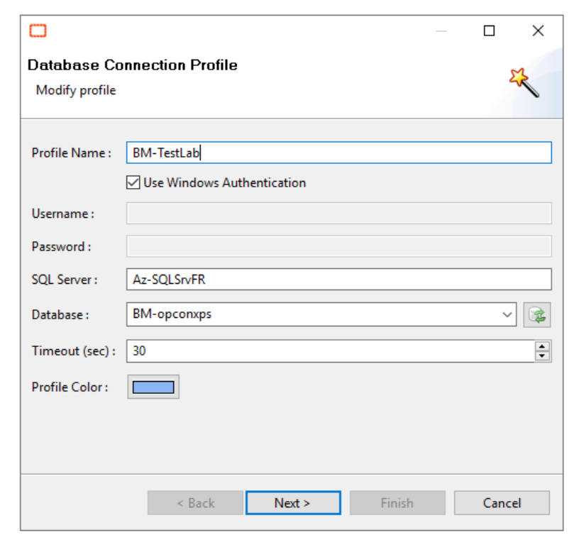
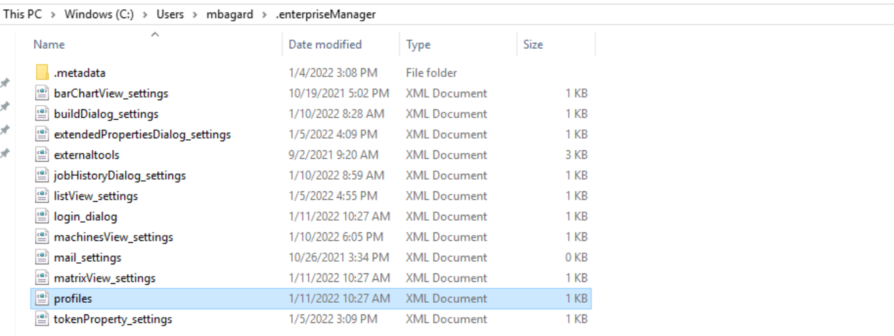

## Export an Enterprise Manager Profile

**Enterprise Manager connection profile**

To access OpCon for the first time from the **Enterprise Manager** interface, you'll need to create a connection profile to link your "EM" to the **OpCon SQL Database**.

If you need to set up multiple workspaces, it can be easier to **share** a predefined profile to user.

The profile information is stored in an **profiles.xml** file located under the Windows user and then **.entrerpriseManager**. For example : `C:\Users\mbagard\.enterpriseManager`

You just need to share this **profiles.xml** file to another user and drop it to the same folder. When the user will start is EM, the profile will be available for connection.

:::info Note 

The **profiles.xml** does not contain any connection information about a specific user, it does only contain a SQL user and encrypted password to connect to the OpCon Database. 

:::