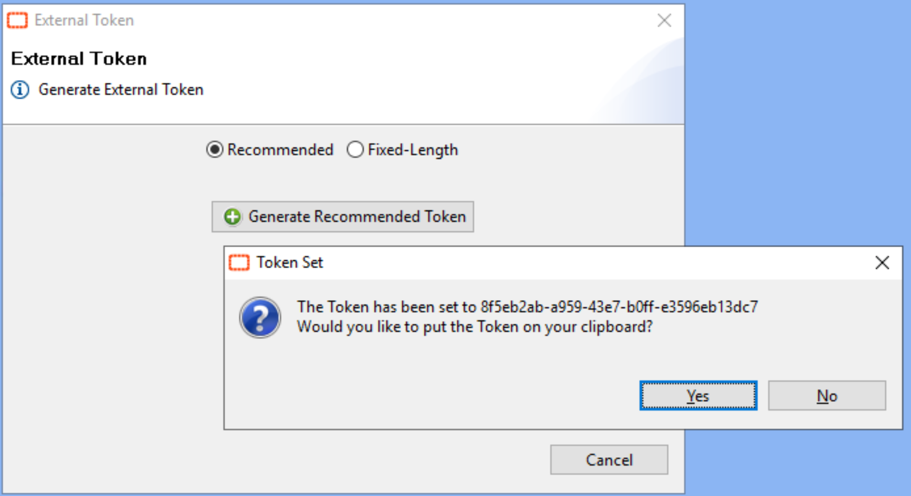

## External Event Password

**External Event Passwords ( < 20.0.0 )**

Before the release of OpCon 20.0.0, the password for external events was **automatically** created at the same time as the user account and set to a default value of 20 stars (`********************`).

This system wasn't flexible as it was impossible for an admin to disable a user external event password and it was also difficult for a user who had forgot his password to retrieve it.

**External Tokens ( > 20.0.0 )**

Since the version 20.0.0, External Event Passwords have been replaced by an **"External Tokens"** system offering more flexibility and more security.

* External Token values are now salted and **hashed** for storage in the database.
* The ability to use External Tokens may now be **disabled**. By default, this is disabled for all new users.
* External Tokens are now **system-generated** values. Pre-existing users will not have their existing token values updated, but if the value needs to be changed or for any new user this will no longer be a user provided value.
* The new system-generated External Tokens will be unique identifiers. When this option is selected, the External Token may be used as a token for the **SMA OpCon RestAPI** and no longer require authentication with an interactive username and password.
* The ability to generate a **fixed-length password** has been provided for backwards compatibility on Agents that do not support unique identifiers as a value. The value will still be system-generated.

**How to generate an External Token?**

The admin must disable the **"External Token disabled"** security on the User Accounts page:

Next, you need to log in to the **Enterprise Manager** with the account for which you want the token:

Then from this tool you can generate both recommended or fixed-length token:

You can also generate a token from your **Profile** on the **Solution Manager**:

The use of the token remains the same as before with the password:

