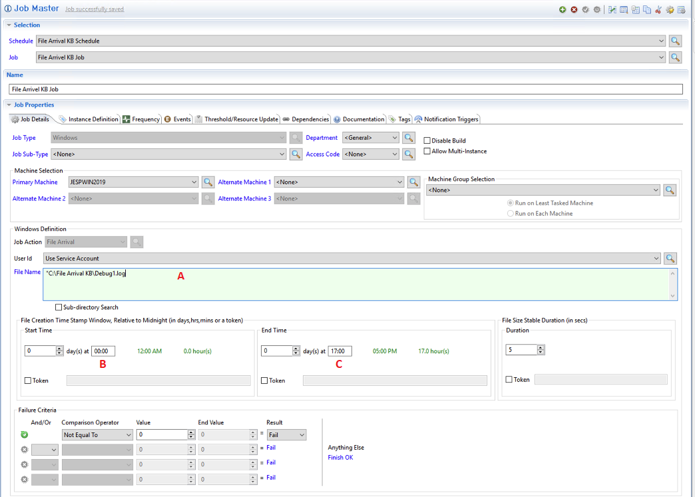
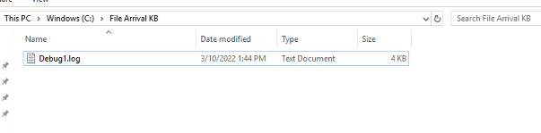
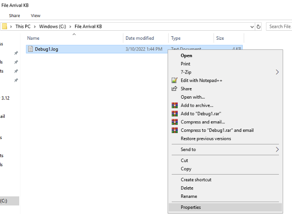
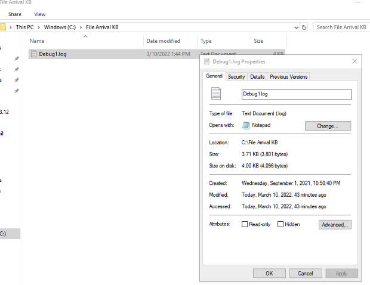

## File Arrival Not Detecting the File

**What is the issue?**

If you are encountering a **File Arrival** job with set parameters within a time frame but the file has not been detected, this guide will assist determine the root cause and solution.

**Troubleshoot and solve the issue**

We will see how to review the job parameters to solve the undetected file issue. Let's take an example:

1. Verify the File Name is correct and in the location of the path **A**:

2. Verify the time it set for the **Start Time**
3. Verify the time it set for the **Stop Time**

**B** and **C** are the time frames that **File Arrival** will be look for to catch the file(s). In this example it’s looking for a file from 12am until 5pm with a creation date of 03/10/2022.

:::info Note 

File Arrival will scan for files that were created within the day and time frame. If the file was not created on this day but has a modified time for this day, it will not catch the file in question.

:::

In this example you will notice the Date Modified column has the date of 03/10/2022, this is the correct date for the jobs parameters for this example, but the columns do not display the creation date of the file.

The image above will list the File in the correct path, right click on the file, click Properties.

The image above shows the **modification** was done on March 10th, 2022, but the **creation date** of the file is September 1st, 2021. Due to the creation date not being within the date of March 10th, 2022 parameters, the file will not be processed.

In the log file, the SMAFileWatcher will display the parameters of the job:

*3/10/2022 10:53:10:581 **FileName**: C:\File Arrival KB\Debug1.log*

*3/10/2022 10:53:10:581 **FileAction**: Create*

*3/10/2022 10:53:10:581 **StartTime**: 3/10/2022 12:00:00 AM*

*3/10/2022 10:53:10:581 **EndTime**: 3/10/2022 5:00:00 PM*

When a new file is detected in the monitored folder, this is reported in the log file:

*3/10/2022 10:53:13:898 C:\File Arrival KB\Debug1.log : Matching debug1.log with debug1.log*

*3/10/2022 10:53:13:898 C:\File Arrival KB\Debug1.log : C:\File Arrival KB\debug1.log **Did not match monitoring criteria***

**Best Practice and Workaround**

**Best Practice** is to notify the file sender stating the creation of the files are not in line with your configuration, request if they can update their process to provide files with the creation date of the job parameters.

**Work around**, the file can be copied and pasted back into the directory. If the file is copied and pasted the creation date will change to the day it was copied.