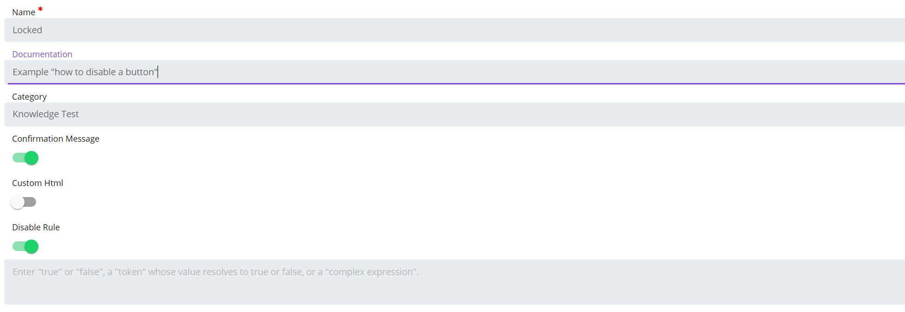

## Hide or Disable a Self-Service Button

Self Service is a **licensed module** for OpCon in SMA Technologies' next-generation web interface. It is an innovative solution that empowers front-office staff to trigger OpCon workflows without having to engage the IT department.

**Disable a button**

To disable a Self-Service button, you first need to enable the **"Disable Rule"**. Once enabled, it will display a field where it's possible to set a token whose value resolves to true or false, or a complex expression allowing us to create a more elaborated rule.

We have several options to lock a Self-Service button. Let's see a few of them. We will not review the easiest solution by putting only "true" or "false" in the rule.

**With a Global Property** 

It's possible to lock the button using the value of a **Global Property** (not necessary a "true" or "false"). It can be useful to lock the button and unlock it when the property is updated automatically or not. 

It can be also interesting to use this when you want to put in place a system when a user "A" has a button to unlock another button to user "B" to perform an action, providing by this way a layer of control and security if you don't want user "B" to start some process without the control of another user.

Then we need to define the Disable Rule:

If the condition set in the rule is fulfilled, the button is **greyed out**:

**With a Complex Expression**

With a **complex expression**, we can do something far more sophisticated than with a simple property. We'll see few useful examples to start building more complex things.

In the first example, we want to disable the button if a job isn't in a "Finished OK" status yet. Here, we don't want a user to start a process until the job "SMA Database Backup" from the schedule "SMAUtility" isn't completed. 

The rule : `[[JI.$JOB STATUS.[[$DATE]].SMAUtility.SMA Database Backup]]!="Finished OK"` means that if the status is different than "Finished OK" for the job SMA Database Backup of SMAUtility schedule on the date of today, the condition is true and the button is locked. As soon as the job is **"Finished OK"**, the expression !`="Finished OK"` is no longer true and the button is unlocked.

In the second example, we want to restrict the access to the button outside of working hours, so we'll build an expression that is true when `[[$TIME]]` is before the opening hour and true after the closing hour.

The rule : `[[$TIME]] < "08:00:00" || [[$TIME]] > "18:00:00"` means that the button will be disabled between 6 PM and 8 AM. Please note the double pipe || which means **OR**.

In the third and last example, we want to mix both previous conditions into a single one. Here is the power of the complex expression because we can create a complicated rule to disable the button.

The button will be disabled if we're outside of the working hours **OR** if the SMA Database Backup job isn't "Finished OK". The rule will be (**A** OR **B**) OR **C**

:::tip Reminder 

A button is disabled when the condition is true. If you're assembling conditions, below a reminder of the OR/AND operators.

:::

**Hide a button**

To hide a button, you have to enable the "Hide Rule" on the Edit Service Request page:

For the rule, this is the same principle than to lock a button. You can use true/false, a global property or a complex expression.