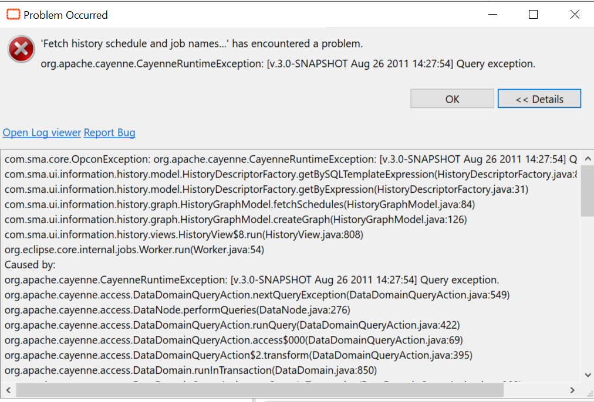

## History Management Timeout

The **Enterprise Manager** contains Management tools to retrieve OpCon data about the History of the jobs or to Audit all the modification performed for a selected time period. 

**What is the issue?**

You may encounter a **"Query Exception"** error while retrieving the requested information after waiting a moment. Most of the time, this is a timeout issue because you're trying to look on a huge period of time (e.g., a year). 

Below an example of the **Query Exception** error for the History Management: 

And an example for the Audit error: 

**How to solve this?**

Two ways to solve this issue:

1. **Reduce** the time frame of your research. Instead of searching for information on a whole year for a job that ran a month ago, reduce to 2 months.

2. The second option is to increase the Timeout of your profile, this is usually solving all the timeout issue.  

3. Click on the **Enterprise Manager** button on your top-left EM

4. Preferences > Connection Profiles

5. Select your profile and click "Edit"

6. Increase the Timeout (sec) to **60 or more** if needed

7. Click Next and Finish

You can now retry your search in the **History** and **Audit**. 
