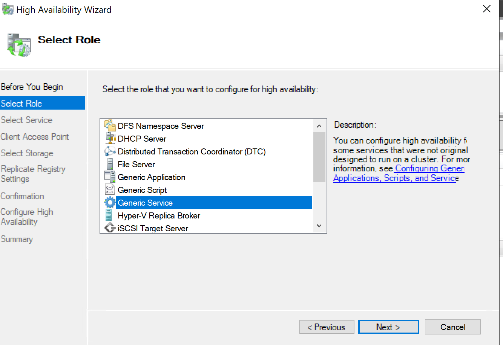
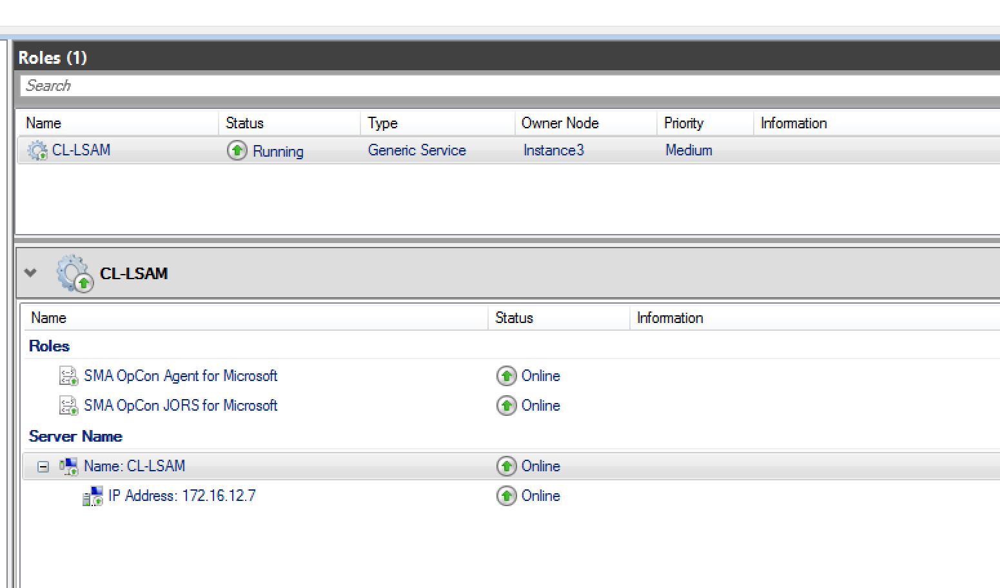
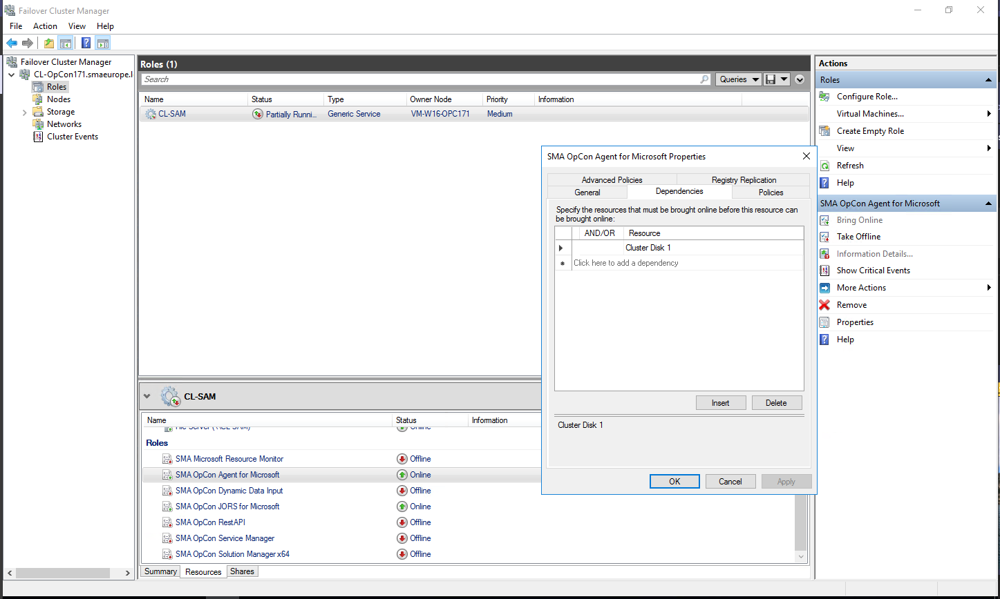
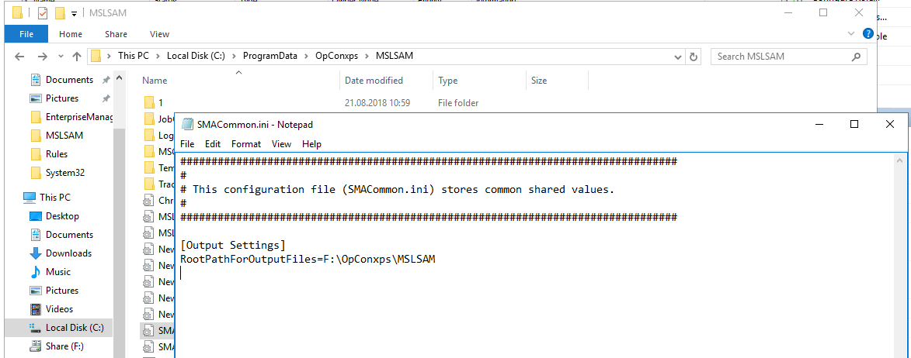
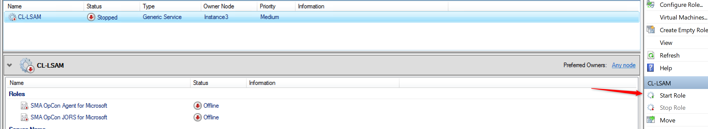
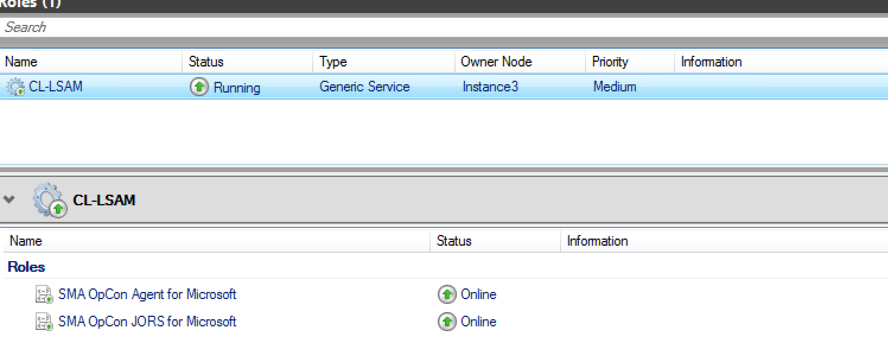
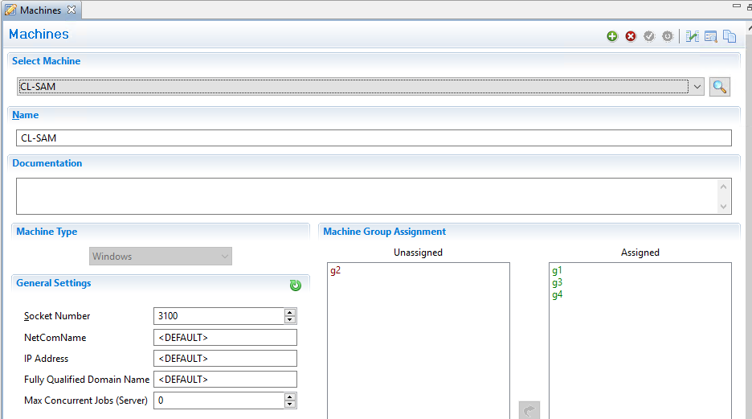

## How to Install MSLSAM On A Cluster

**Clustering purpose?**

This article describes how to install the **MSLSAM** on a **Microsoft Cluster**, the purpose here is to set your agent in High Availability mode, so if one node crash or the service come down, another node will take the communication with the OpCon server, and your jobs will continue to run without any manual actions.

**Requirements?**

* MSLSAM installation source
* Windows servers with Failover Cluster Manager feature
* Basic understanding of Windows Server clustering

**How to install?**

Proceed to a normal MSLSAM installation on both servers.

Start the **Failover Cluster Manager** tool and import the **MSLSAM services** (Agent and JORS) to the **Cluster** with shared disk:

You can add the **JORS** service or other resources by clicking on add *Resource*.

You can add a Dependency, a dependency is a resource you have to bring online to have your Roles(Generic Service) online.

Change the **SMACommon.ini** to the **Shared disk** to centralize logs:

**Start** the service in **Failover Cluster Manager**:

Connect to the EM and configure the machine using the **cluster name**:

Another valid option is to install the MSLSAM on the shared drive, in that way the MSLSAM config and tracking file is handed over to the other machine as well, but if there is an error in the config file or the MSLSAM files the failover machine will pick up the same errors from the shared drive.

:::caution Important 

You should use the cluster name in the OpCon machines and on cluster management the MSLSAM service should have a dependency on the cluster name. So if the Agent is active on the other node, even the cluster name must point to this node.

:::