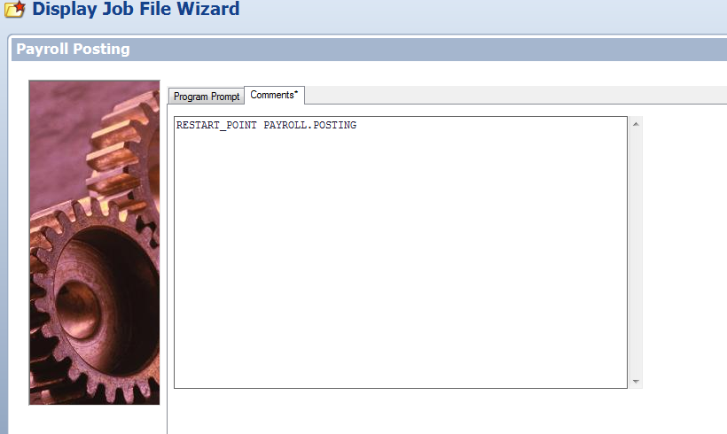

## How to Perfomr a Restart Point in a Symitar Job

**What is the issue?**

If you're encountering issues with a Symitar job that has failed and needs to be restarted at a specific point, this article will guide you step by step to troubleshoot the problem.

**Troubleshooting**

1. Determine the **Episys** jobfile you would like Opcon to begin processing. If the jobfile is part of a series of nested jobfiles, Opcon will run this jobfile and any subsequent jobfiles. Add the comment to the job inside of the main job.

So if **PAYROLL.POSTING** is the point where you want to restart, then the **RESTART** will run that jobfile and all subsequent jobfiles in this sequence. Add the comment to the **PAYROLL.POSTING** job.

2. Add the **RESTART_POINT** flag to the comments section of the **Episys** Jobfile:

3. Add the corresponding flag to the Daily job in OpCon:

a. Do not add the words **RESTART_POINT**
b. If you are not using a sub type, add the comment to end of the start image

4. Restart the job in Opcon.

5. Once the job is complete, **remove** the **RESTART_POINT** flag in Episys.

:::info NOTE 

If you have any SEQ jobs that depend on output from the original process, these jobs will fail as the OpCon program overwrites the original output.

:::

6. If the Job Sub-Type is None the Restart Point goes at the end of the Start Image in double quotes

a. `[[RSJPATH]]/RSJ SYM000 test "restart point"`

