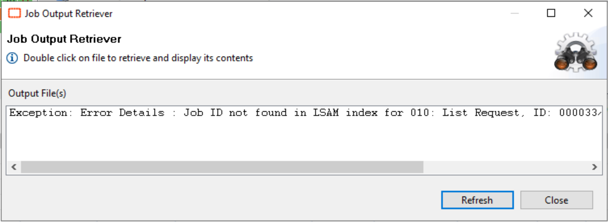
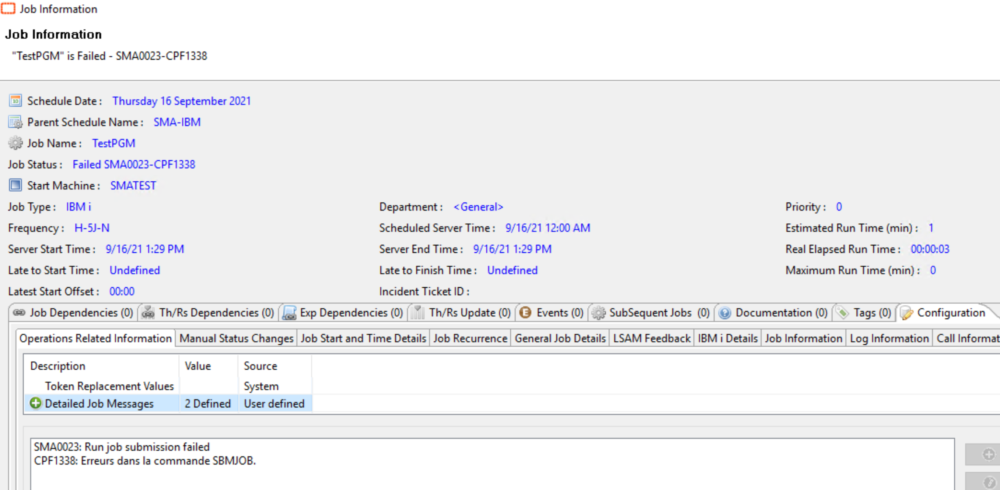
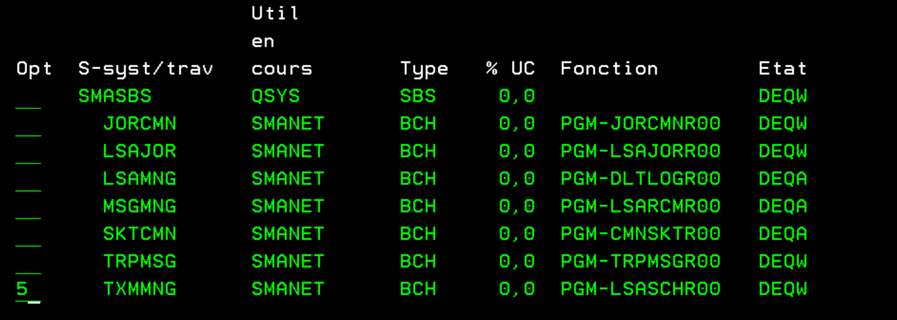
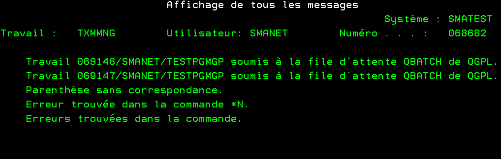
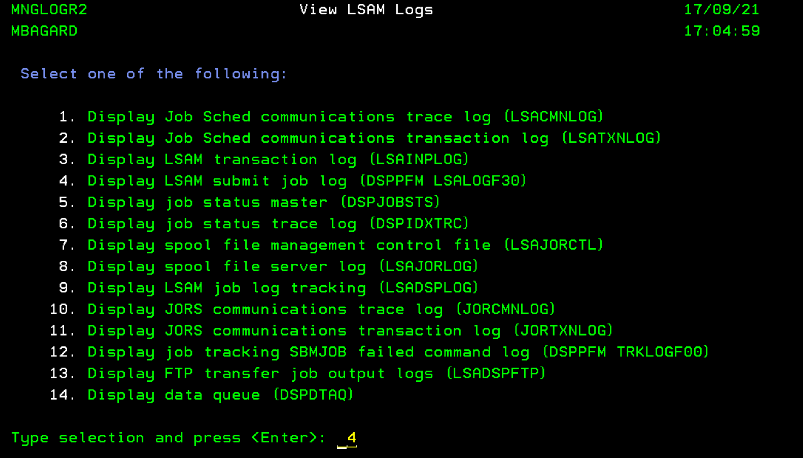
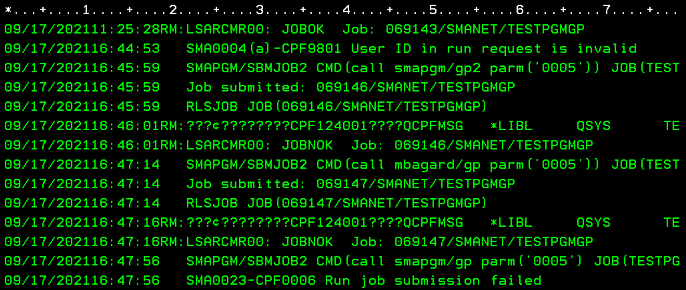

## IBM i Job Basic Troubleshooting

This article is designed to help you perform basic controls on your Enterprise Manager and **IBM i LSAM** to troubleshoot a job failed. It will give some tips about where you can find relevant information to help you understand why your job is failed.

**Initialization Error**

One of the first issue you may encounter is an **Initialization Error**. It means that your job failed before it submission to the IBM i. As the job was never started on the IBM i, we can't retrieve a log from the LSAM.

If you try to retrieve the log, you'll end with this message:

**No need to go further with the log if you've this message. **

To get information, you can right-click on your failed job > Job Information > Configuration tab > Operations Related Information.
In the **"Detailed Job Messages"** field, you're likely to find details about the return code of your job

**LSAM-side logs**

It's possible to retrieve on the LSAM side precious information about what is submitted by OpCon. 

**TXMMNG job**

The **TXMMNG** job performs the actual tasks requested by OpCon transactions. For example, it submits jobs to IBM i.

The log of this job is available under the LSAM Menu > LSAM Management Menu > 3 (Check LSAM subsystems status) > 5 Next to TXMMNG.

On the next screen, enter 10 to get to the log and F10 for details:

You can find here some useful information about the job submitted by OpCon like an error in the command, a parenthesis issue, etc.

**LSAM Submit Job Log** 

This log is useful to retrieve the command line sent to the LSAM by OpCon. It's very helpful to check for example when you've an error in your command if a character is **not translated** correctly by the IBM i.

To access the log : LSAM Menu > 6 (LSAM Management Menu) > 5 (View LSAM logs) > 4 (**DSPPFM LSALOGF30**):

Below you can see an example of the log displaying command submitted to the LSAM with some extra information such as **"User ID in run request is invalid"**.

