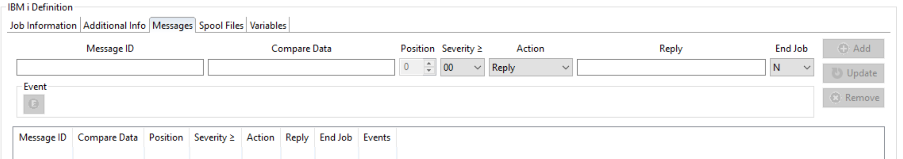
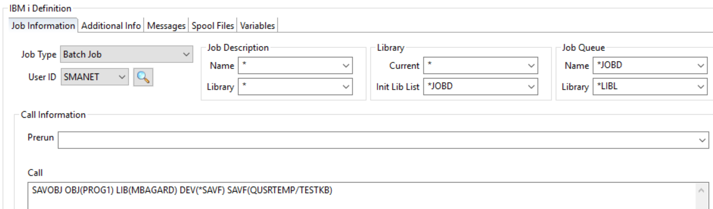
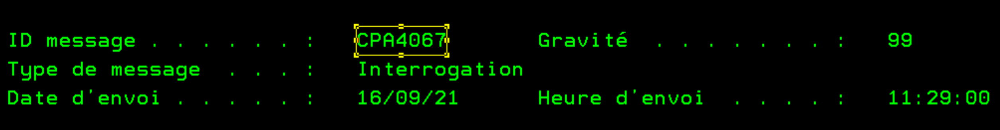
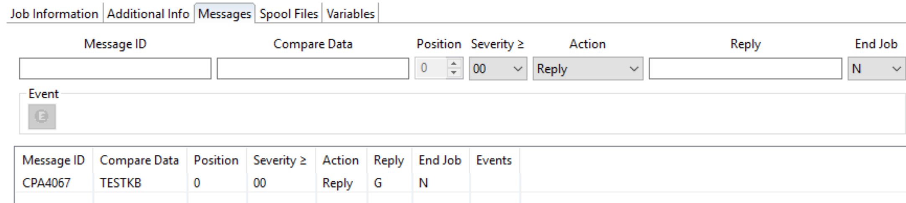
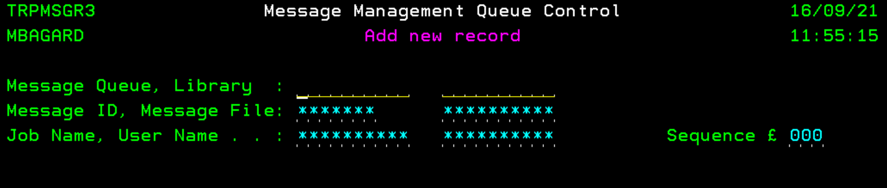
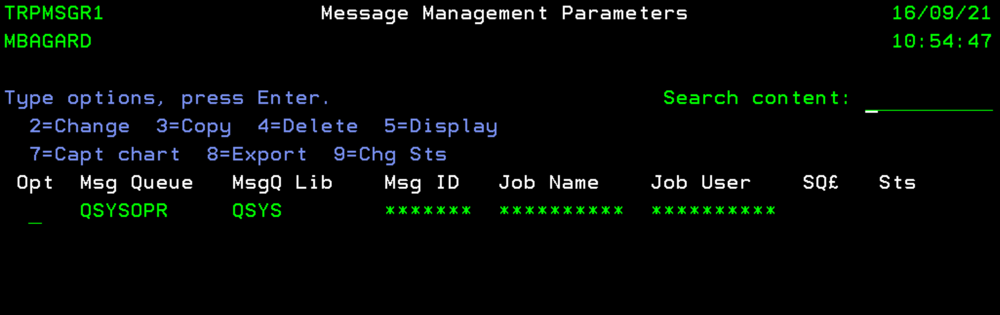
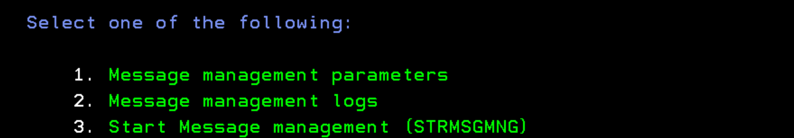
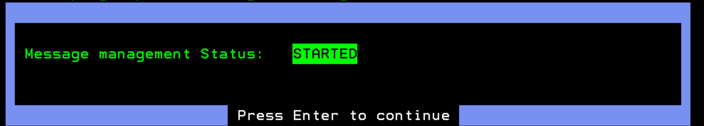
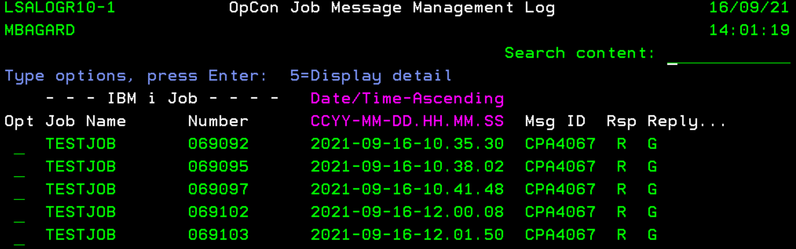
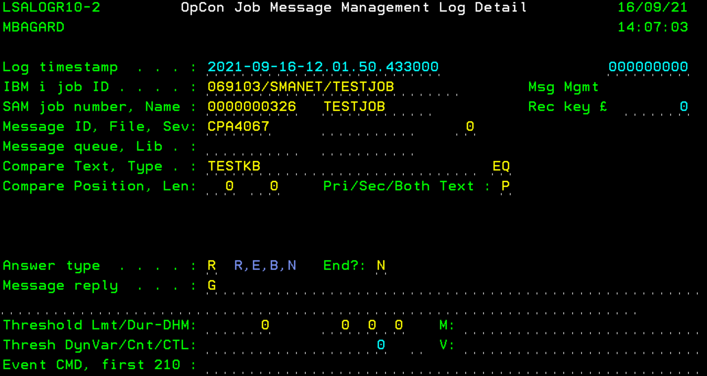

## IBM i Job Messages

**Messages**

The **"Messages"** function is designed to detect if a defined message is returned by your job. Then, following the message you can set up different actions like a reply or an OpCon event.

**How to use it**

Let's take an example to illustrate the usage of this feature. A simple job is created to perform a save of an object on the IBM i:

The object has already been saved in QUSRTEMP/MBAGARD save file, so it will trigger a message saying that data are already present in the SAVF. We'll catch this message in our example.

Message ID **CPA4067** is returned as the SAVF is not empty. The job is stuck in a MSGW status and wait for an answer "C" for Cancel or "**G**" for Go.

**Message definition - OpCon side** 

Let's detect this in our job and send a "**G**" reply to the IBM i:

In our example, we need to specify the Message ID : **CPA4067**, we also want to find "TESTKB" in the message. Position stay at 0 and is optional, no severity modification. For the Action, we'll just go with "**Reply**" and as a reply will send a Go to the IBM i which is a "**G**". Finally, we don't end the job so we let "**N**".

Now, our message is defined in the job. However it's not enough, we also need to specify to the IBM i LSAM to look somewhere for a message.

**Message definition - LSAM side** 

To define a queue to monitor, you need to go to the LSAM Menu > Option 2 (Message Management Menu) > 1 (Message Management Parameters)

On this page, you can manage the **MSGQ** you're monitoring. To add a Message Queue to monitor: **F7**.

Then you can specify the **Message Queue/Library** you're monitoring. You can also let "`*`" to look for everything or you can change the parameters to look for something specifically.

Once you've save your new record, you need to start the Message Management: Option 3 on the previous menu.

By entering 5, you can check the status of your Message Management:

It's enough! You have now the basic knowledge to use Messages.

**Messages Management Log**

You can retrieve the log files of the messages handled by your LSAM from the LSAM Menu > **2** (Messages Management Menu) > **2** (Messages Management Logs) > Option **2**:

To get more details, you can use option **5** next to the log file:

Finally you can see when the reply was sent, what was the reply and if the job was killed or not.

