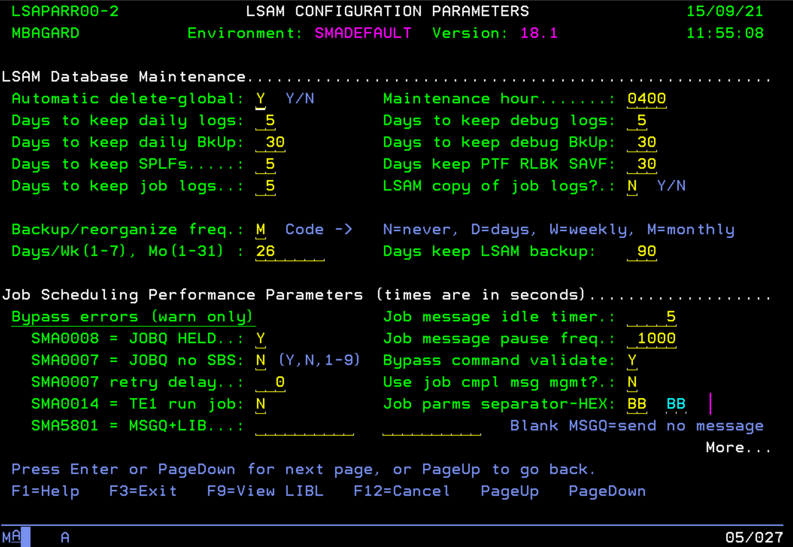

## IBM i Maintenance

In this article, we'll see how to access the **IBM i LSAM** Parameters menu to configure the Maintenance.

**Access to the Parameters screen**

To access the maintenance screen, from the LSAM main menu: Option 7 "**LSAM Parameters**", then page down to see the "**LSAM Database Maintenance**" section.

**Maintenance Settings**

From this screen, you can configure the maintenance of your IBM i LSAM including when the daily maintenance task is started (Maintenance hour), the retention of the logs/backup in days, etc.

You may encounter an issue where the maintenance task running by **default at 04:00 AM** is creating a conflict with one of your job or if for example you've two LSAM installed on your system starting the daily maintenance at the same hour. Another possible scenario is when you've two LSAM on your environment running the maintenance at different time but an IPL occurs during the maintenance period of both LSAM, when the IBM i LSAM will start, they'll start the maintenance at the same time creating a conflict between them.

To change the "**Maintenance hour**", simply enter a new time with the format HHMM. You'll then need to restart your agent from Main Menu > **6** **"LSAM Management Menu"** > End LSAM / Start LSAM or by using directly the command **ENDSMASYS** and **STRSMASYS**.

**To go further**

You can check the online documentation for more information about the different settings : [IBM i LSAM Configuration](https://help.smatechnologies.com/opcon/agents/ibm-i/configuration/)