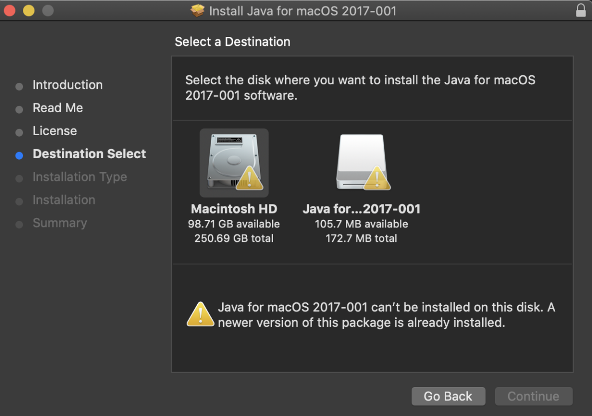

## Install Enterprise Manager on Mac

**Install Procedure**

1. **Download Enterprise Manager**.

    a. Download the EnterpriseManager-macosx.cocoa.x86_64.zip of your current **OpCon** release.

2. Open a command line and run the command to allow MacOS to run **EnterpriseManager.app**

    a. cd `<EM Install Dir>`

    b. xattr -c EnterpriseManager.app

3. **Download AdoptOpenJDK 8 JRE .tar.gz:**

    a. https://adoptopenjdk.net/releases.html

    b. OpenJDK 8 / JRE (38MB) .tar.gz (You can also find it in the article attachment)

    c. **Extract** the JRE, **rename** the folder « jre8 » for this guide (Not mandatory)

    d. **Move** that folder where that makes sense for you / You can just move it into the EnterpriseManager install folder

4. **Update** the **EnterpriseManager.ini** to point to the jre8 downloaded in step #3

    a. Right-click on the **EnterpriseManager.app** and select show packet content (or something similar)

    i. This will drive you into the app folder, then drill-down into

    ii. Contents/MacOS

    iii. Open the **EnterpriseManager.ini**

    b. From here you’ll have to add the location of the jre8 (in the example below it is a relative path to the Enterprise Manager)

    i. Insert a line 5 with « -vm »

    ii. And insert a line 6 with the absolute path until the embedded Jre8 of your installed EM « ../ jre8/Contents/Home/jre/lib/jli/libjli.dylib»

iii. Line 7 should now be « -vmargs » (which was line 5 before we edited the file)

iv. Save the file

Now you should be able to double-click on the **EnterpriseManager.app** and run it. You might see a security message that ask you to allow the app to run as it was downloaded from an unknown location, that is fine just go under your MacOS settings -> Security and allow Enterprise Manager to open.

**Issues when you start the Enterprise Manager?**

If when you are double-clicking for your **Enterprise Manager** you receive the following error:

The old java version can be downloaded here [https://support.apple.com/kb/DL1572?locale=en_US](https://support.apple.com/kb/DL1572?locale=en_US) to download **Java for OS X 2017-001**. (See also article attachment)

Also, when you are attempting to install the package another error may pop up

Below with a complete solution to bypass this error:

[https://www.l3harrisgeospatial.com/Support/Self-Help-Tools/Help-Articles/Help-Articles-Detail/ArtMID/10220/ArticleID/23780/Mac-OS-Catalina-1015-ENVIIDL-and-Legacy-Java-6-Dependencies](https://www.l3harrisgeospatial.com/Support/Self-Help-Tools/Help-Articles/Help-Articles-Detail/ArtMID/10220/ArticleID/23780/Mac-OS-Catalina-1015-ENVIIDL-and-Legacy-Java-6-Dependencies)

That allows you to create a Pkg file to install the modified **Java 6**.