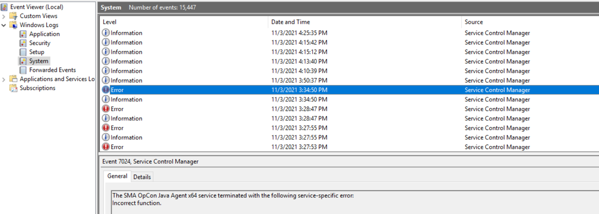
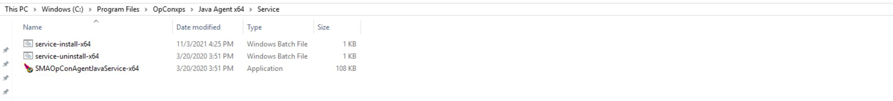
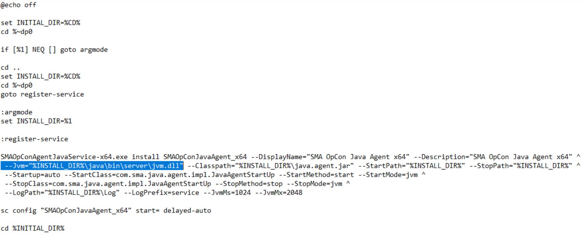

## Java Agent Service Will Not Start

**What's the issue?**

If you've installed the **Java Agent** on your environment, you may encounter a situation where you're not able to start the agent's service.

On your Windows Events Viewer, you'll find in the System logs an "**Incorrect function**" error at the startup of the agent:

**How to solve it?**

* The following process will show you the steps to fix the service:
* Log on as administrator
* Run the service-uninstall-x64.bat to remove the entry in Services
* Edit the service-install-x64.bat file and change the -Jvm option to: `--Jvm="%INSTALL_DIR%\java\bin\server\jvm.dll"`
* Run the service-install-x64.bat
* Start the SMA OpCon Java Agent x64 service

:::info Note

You'll find .bat files in the installation folder \Service of your Java Agent:

:::

The service-install-x64.bat script:

