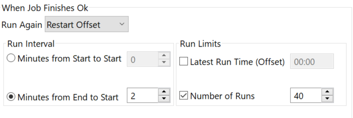
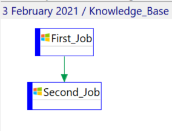
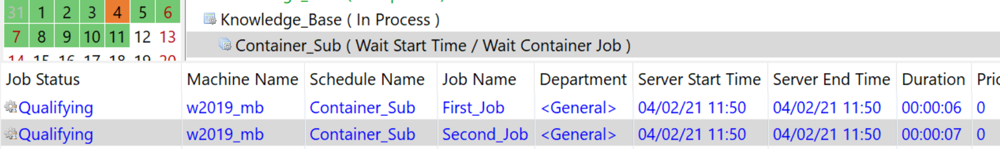

## Job Dependency And Auto Restart

**What is the issue?**

One behavior you may encounter with **OpCon** is that a Job dependency is not resolved even if the previous job is "finished ok". In this particular case, the job targeted by the job dependency has a restart "**when Job Finishes Ok**"

Just like in the example below:

Looking at your **Job History**, you can see that the job is indeed **Finished OK** but the dependency is still not solved. Why?

Let's take a complete example: 

**Both** jobs have a frequency with an automatic restart when the job is finished ok. The Second_Job has a dependency on the First_Job on Requires Finished Ok.

What happens in this case is that once the First_Job is finished, it's submitted again for a restart and waits its new start time. The job is very briefly in a "Finished OK" state and quickly changes for Wait Start Time. The dependency doesn't have the time to get the information that the First_Job is Finished OK. 

**What you can do**

The solution is **simple**, you can just put the 2 jobs into a **Sub_Schedule**, remove the **restart** from both jobs and instead put the restart on the **Job Container** that will contain your Sub-Schedule. The sub-schedule's jobs will run normally and when they're both finished ok, the container will restart the whole sub-schedule. Now the job dependency works as intended!

You will end up with a Schedule with a container that holds a sub-schedule:

