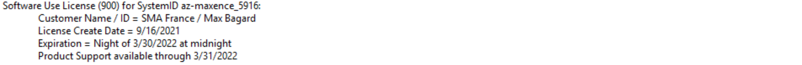
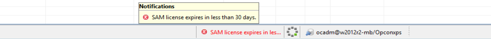

## License File Location and Notifications

**Where To Place A New .LIC File?**

If SAM is installed on the C drive, please copy the license into the SAM directory on your Windows server, this would be `C:\ProgramData\OpConxps\SAM`. This will overwrite the previous file and can be applied at any time during the day, an idle processing window is not required. The new license should take affect within 2 hours of it being copied into the SAM directory.

If SAM is installed on any drive other than the C drive, please copy the license into the SAM directory on your Windows server chosen during the install. This will overwrite the previous file and can be applied at any time during the day, an idle processing window is not required. The new license should take affect within 2 hours of it being copied into the SAM directory. If the license information is not updated after 2 hours please attempt to restart the SMA Service Manager service on the OpCon Server during a quiet time.

If OpCon was installed on a Docker container, the license file will be copied in the volume `../opcon/core/config` corresponding to the internal directory `/app/config` of the container

**License Expiration and Support Availability**

Your license contains two different dates, like in the example below:

* **Expiration**: this is the software expiration date (see part 1, 2 and 3 of this article). After expiration of the grace period, OpCon will no longer be operational until a new license is applied.

* **Product Support**: this is the expiration date of the support. This will not have any impact on OpCon operation.



**1. LICENSE expires in Under 30 Days…:**

This is the first notification you'll receive to let you know that your license will be expiring in less than 30 days.

```
-----Original Message-----
From: opconxps@smatechnologies.com 
Sent: Wednesday, January 29, 2020 5:15 AM
To: SMA Support <support@smatechnologies.com>; License <license@smatechnologies.com>
Cc: example@smatechnologies.com
Subject: License Exception Notification for Enterprise Services - nzhlzvpolwn006_5354
ID=11355 Event Trigger=OpCon/xps Event | Message=The following message has been generated by SAM: 
License Exception Notification for Enterprise Services- nzhlzvpolwn006_5354
***** WARNING ***** License expires in less than 30 days!
```

**2. LICENSE HAS Expired – Grace Period of 7 days allowed:**

Once a OpCon license has expired SAM will enter emergency mode. It will require a new license file before reaching midnight on 7th day of Emergency Mode.

```
-----Original Message-----
From: example@smatechnologies.com 
Sent: Saturday, November 16, 2019 1:01 PM
To: SMA Support <support@smatechnologies.com>; License <license@smatechnologies.com>
Cc: example@smatechnologies.com
Subject: License Exception Notification for Credit Union - dtnipopcon01_5922

ID=283289 Event Trigger=OpCon/xps Event | Message=The following message has been generated by SAM: 
License Exception Notification for Credit Union - dtnipopcon01_5922
***** WARNING ***** License has expired!! A grace period of 7 days is being allowed
```

**3. LICENSE HAS Expired:**

Once the 7th day of emergency mode has finished, SAM will shutdown and OpCon will stop. SMA Service Manager will be unable to start until a new license file is placed in the SAM folder.

```
-----Original Message-----
From: example@smatechnologies.com
Sent: Wednesday, February 12, 2020 11:27 PM
To: SMA Support <support@smatechnologies.com>; License <license@smatechnologies.com>
Cc: example@smatechnologies.com
Subject: License Exception Notification for Credit Union - opcon2016_6141
ID=10044 Event Trigger=OpCon/xps Event | Message=The following message has been generated by SAM:
License Exception Notification for Credit Union - opcon2016_6141
***** WARNING ***** License has expired!
```

**4. LICENSE VIOLATION:**

This is a result of too many LSAMs being marked as communicating with SAM at one time. Each license is different so it may very how many of what type of LSAMs are authorized per customer.

```
***** WARNING ***** The maximum number of Windows machines has been exceeded.
License permits 1 but the number marked up is currently 2
Software Use License (900) for SystemID srv000260_5655:  *** V I O L A T I O N ***** V I O L A T I O N ***
    Customer Name / ID = Credit Union / Production
    License Create Date = 12/26/2019
    Expiration = Night of 1/30/2020 at midnight 
    Product Support available through 1/31/2020

    Total licensed Windows machines = 1 ---> Current number marked up = 2
    Total licensed UNIX machines = 1 ---> Current number marked up = 1
    Total licensed MCP machines = 1 ---> Current number marked up = 1
    Total licensed SQL machines = 9,999 ---> Current number marked up = 0
License Violation Warning: Mark extra machines down before 12/27/2019 8:26:34 PM or the license will be voided.
```

:::info Note 

You can avoid a license violation by disabling quickly the communication of the unauthorized machine.
:::

**5. How to request a license?**

As soon as you've a **pop-up** in your **Enterprise Manager** that warns about the close expiration of your license, please reach out our license team at license@smatechnologies.com
You can also reach our license team for all your license requests (license renewal, license ID has changed after environment modification, new server, etc.)



