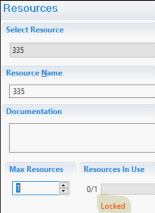
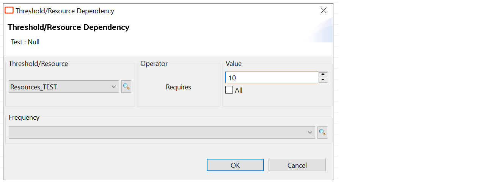

## Locked Resource In OpCon That Cannot Be Freed

A **resource** is a user-defined value consisting of a name and a numeric limit. Resources are used to manage and limit the number of concurrently running jobs across schedules and machines in OpCon, they're flexible because they are platform independent and easy to manage.

**What is the issue?**

It can happens that a resource remains **locked** because a job dependency on a resource has been defined to use **all resources** available and then the job is not able to release the resource once completed.

You can try to manually unlock the resource by following these steps:

1. Restart the Job in question to "**On-Hold**"

2. Mark the job **finished ok**, and that should release the lock.

If the **lock** is not released, please create a support case. The support will look at the OpCon Database to remove the lock.

**Advice when using resources**

It's better to use a defined value instead of "**All**" to avoid any lock issue:

