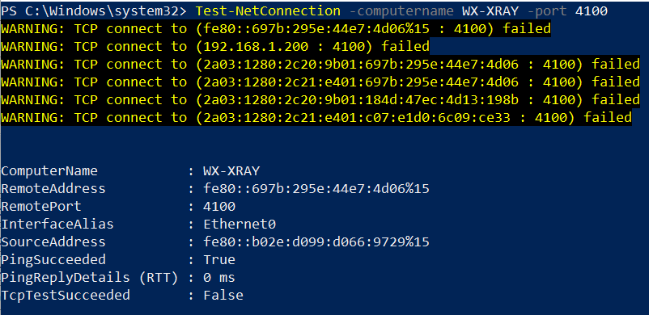

## LSAM Not Communicating

**What is the issue?**

When you install a new LSAM on a server, you need to create a new Machine in the **Enterprise Manager** to connect your new **LSAM** to OpCon.

You'll find in this article some issues you may encounter with your new machine and some tricks to solve them. 
 
All the communication between **OpCon** and the agents (**LSAMs**) are handled by the process named **SMANetCom**. The **SMANetCom.log** is a good start to understand what's wrong with the communication. 

Most of the time, the log files are located here: `C:\ProgramData\OpConxps\SAM\Log`. But if your OpCon is installed on another disk, it will be something like `D:\OpConxps\SAM\Log`.

Let's see 2 examples of the most common error messages in the SMANetCom.log : 

* `ConnectToMachine() -- Exception happens at machine [MSLSAM_Test]: A connection attempt failed because the connected party did not properly respond after a period of time, or established connection failed because connected host has failed to respond`

* `ConnectToMachine() -- Exception happens at machine [MSLSAM_Test]: No connection could be made because the target machine **actively refused** it 192.168.1.1:3100`

**How to find the root of the communication issue?**

It's possible to perform 3 simple tests that will in most of the case help you troubleshoot the problem:

1. **Ping**: just ping the machine from your OpCon server to see if the machine is reachable by your server. If not, this is a Network issue. 

2. **Telnet**: try a telnet command from your OpCon server to the LSAM machine using the communication port of the **LSAM** (e.g. telnet 192.168.1.1 3100). If this is refused, this is a Network and more accurately a Network security issue : check the port in the Firewall. 

3. **Powershell**: if telnet is not activated on your server, you can use a `Test-NetConnection` powershell command instead. The command looks like : `Test-NetConnection -ComputerName Computernamehere -port 3100`

For example:

The 1st command is OK, the machine is reachable. In the second test, the machine is not reachable.

If you only know the IP address of the target server:

**If you're unable to connect to a UNIX LSAM you can check your Firewall settings**

`firewall-cmd --list-all`

Use this command to add the necessary port numbers:

`firewall-cmd -- add-port=3100-3110/tcp`

Next Confirm it worked:

`firewall-cmd --list-all`

If this is not a Network issue, check the **LSAM**:

* Is the **LSAM** started? 
* **LSAM** services are started? 

If the LSAM is started but still not able to communicate, please check: 

* **LSAM** log files 
* Windows Event Viewer and check application log to see if the **LSAM** is failing

