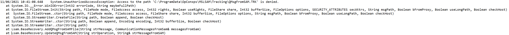

## LSAM Tracking Files Issue

There are few things you can check in order to troubleshoot an issue with the tracking files of your agent. In this article, we'll talk about the **LSAM** installed on a **Windows** machine: *MSLSAM*, *SQL* or *SAP LSAM*.

**What are "tracking files"?**

Tracking files are located in the tracking repository of your agent. These files with extension .trk are transit files for communication between **OpCon** and the **agent**. The agent is getting information from OpCon server that it have to run a specific job and once this job is finished the information goes through this file. The use of tracking files allows the agent to be "independent". For example, if the Windows LSAM is running a job and at the same time lose the communication with OpCon server, the job information will wait in the tracking file. Once the communication is back, the information are sent to **OpCon**. So we don't lose any information if any communication issue occurs or if maintenance restart is needed on the OpCon server for example.

**Where are they located?**

The tracking files can be found under "`C:\ProgramData\OpConxps\MSLSAM\Tracking`" if installed on `C:` or directly under "`OpConxps\MSLSAM\Tracking`" if installed on another disk.

**You may have to enable the hidden items on Windows in order to access ProgramData repository:**

**What is the issue? **

Despite the advantages of the use of tracking files, they may encounter troubles. It's most likely due to a system perturbation or freeze, lack of resources, antivirus scan on the file or anything else holding the file and restricting it access from the LSAM process.

Here are the typical errors you will encounter when the tracking are stuck :

**On the Enterprise Manager side**

The machine remains in communication unless you stop and restart the communication, then the machine will stay in a "**not responding**" status

The number of jobs running on the machine is stuck

The jobs submitted by OpCon stay in a "**Start Attempted**" status

**On the LSAM side**

When looking at the MSLSAM.log in this example, we can clearly identify an issue with access to the tracking file. We usually encounter this kind of error in the log directly speaking about the TRK or xml issue which is most of the time related to the tracking:

**On the system side**

Another interesting thing to check is the Windows Event viewer for applications, there you'll find "**Value cannot be null**" type issue which are also related to the tracking files. You can see that this error is looping every few seconds on the applications events because LSAM is trying to interact with the files without success.

**How to solve this?**

* Disable the job start in the Enterprise Manager or Solution Manager
* Marked Failed jobs which are in the Still Attempting start or attempting start status for this agent (with the SM)
* The number of **jobs running** must be **0** (in the machine status view)
* Stop the Agent Service(s) (2 services for MSLSAM and SAP and 1 for the SQL)
* Rename or delete the tracking files
* Start Agent service(s)
* Enable the communication in the EM or SM

If you don't mark failed the still attempting start jobs, they'll end in a Not Valid status:

