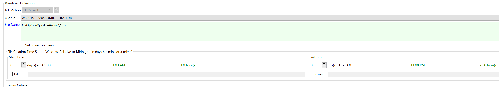
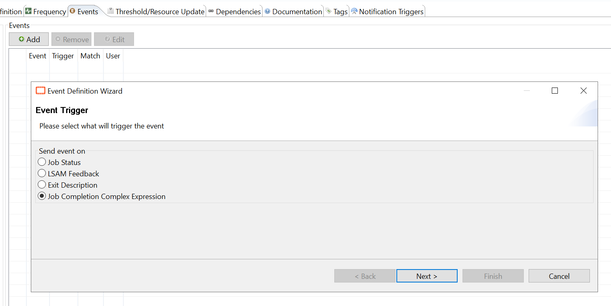
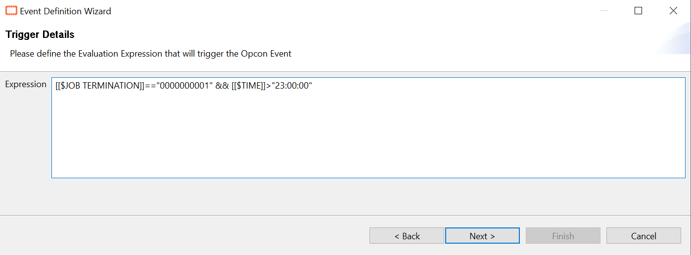
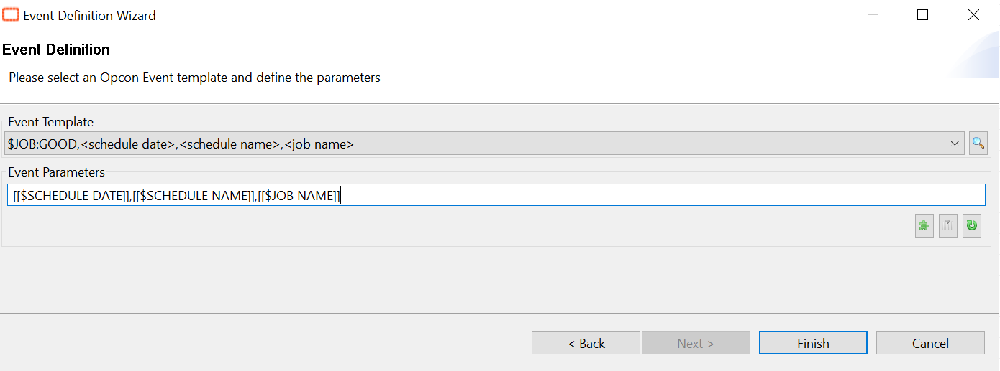
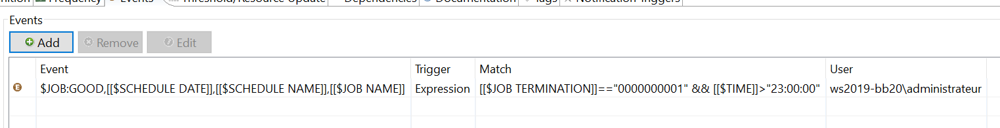

## Manage File Arrival Reaching End Time With Exit Code 1

When a File Arrival job reaches it end time and no file was found, its ends with an exit code **1** and a **failed** status.

Sometimes, not finding a file is normal and you may want to manage this possibility and avoid your job ending as failed. However, exit code 1 is used not only for this special case but also for another reason that makes it a bit more difficult to just simply use the advanced failure criteria of your job.

According to the documentation, the exit code 1 is not only returned for a file not found, more information below:

"The file was not found. Reasons include an invalid filename, the file has not arrived yet, or permissions."

***This is also true for UNIX and IBM i file arrival jobs.***

**How to manage this?**

Let's take an example, below my File Arrival definition:

The job end time is **11:00 PM**.

The next step is to set an event to mark the job as Finished OK **if the exit code is equal to 1 AND if the system time is superior to the end time of the job**:

The complex expression used:

**[[$JOB TERMINATION]]=="0000000001" && [[$TIME]]>"23:00:00"**

:::info Note 

Following your Regional Settings, you may have to specify "AM" or "PM", e.g. "11:00:00 AM".

:::

The event used in this case: **$JOB:GOOD**

In conclusion, with this solution if the File Arrival job finishes normally but without finding the file, it will be automatically set a **Mark Finished OK**.