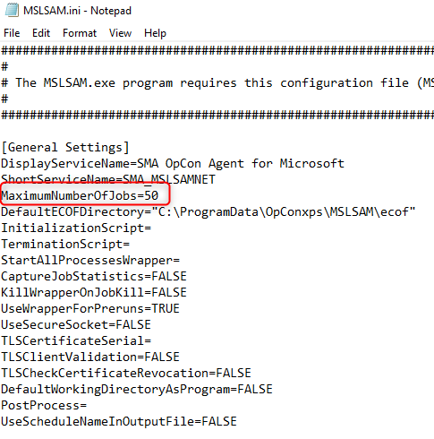
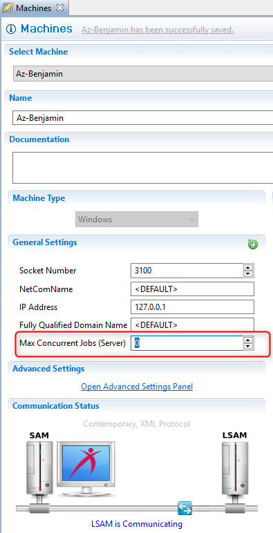
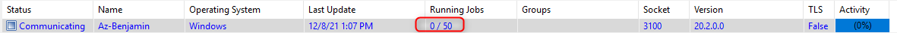
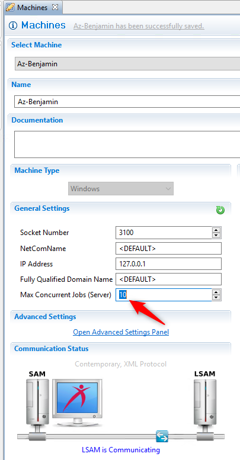
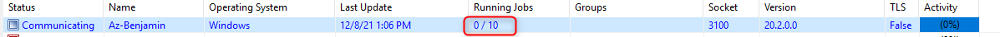

## Manage The Maximum Number of Jobs a Machine Can Run

In this article, we will explain how to manage the Maximum Number Of Jobs a machine can run. We'll use for example an MSLSAM.

**LSAM configuration:**

First, on your agent configuration file, (or option menu depending on the agent you are using) you can set a value **MaximumNumberOfJobs** or similar.

The **MaximumNumberOfJobs** parameter defines how many jobs the agent will be able to run simultaneously, usually by default this value is set to **50**.

You have also probably noticed that on the general settings of each machine in the **Enterprise Manager** you have a parameter **Max Concurrent Jobs** (Server).

By default it is set to 0.

0 means that we will **not overwrite** the value set on the configuration file of the agent, and so the value of the **MSLSAM.ini** will be preserved.

You will notice that like the screenshot below if we don't specify a different value than 0 we get the number 50 as max value for this agent as we preserved the lsam configuration at the agent level.

The **Max Concurrent Jobs** (Server) value is a dynamic value that you can change whenever you want by any value, it will notice the system that we will use that parameter instead of the value of **MaximumNumberOfJobs** at the agent level the MSLSAM.ini

So if I set 10 it will dynamically change the value to 10, and this agent will only be able to run 10 jobs simultaneously instead of 50.

However, you have to know that the **Max Concurrent Jobs** (Server) parameter cannot overwrite the agent parameter **MaximumNumberOfJobs** on the MSLSAM.ini if the value is higher than the one specified in the MSLSAM.ini it will not work. 

As example, the dynamic value in the machine view cannot work if you set 100 because the maximum allowed by the agent will remain 50.

Here, in this example we use a Windows Agent but of course you can apply the content of this article to every LSAM type (UNIX LSAM, IBMi LSAM, SQL, SAP, etc.) as each LSAM contain a parameter where you can set the option **MaximumNumberOfJobs** or the equivalent.