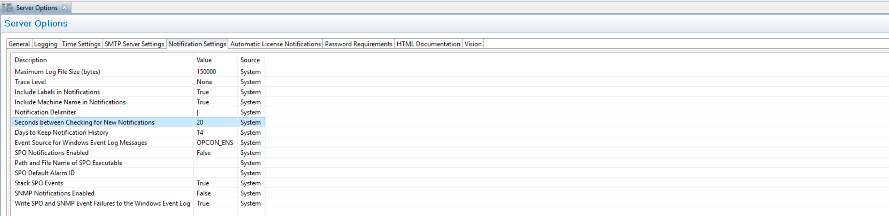

## Notifications Delayed

OpCon offers the possibility to create a wide range of **notifications** based on **triggers** (job, schedule and machine). Notifications allows you to send an email, to send a Windows event, to run a command, etc.

However, as your environment grows you may notice that notifications are **slower** than before. We'll see in this article what the root cause and what you can do to improve the speed of the notification processing.

**Why this issue?**

You've probably defined a lot of notifications and your OpCon environment keep growing as you're adding more and more schedules and jobs into OpCon. At some point, you notice that your email notifications are **delayed**. You may also notice that the **delay** is even more important during the part of the day where there is an intense activity on OpCon (a lot of running schedules and jobs triggering notifications). The delay will reach a peak and then will decrease slowly.

This delay is due to the **congestion** on the database table holding the notifications to send called "NOTIFY". This table should stay close to 0 as it is continuously checked by OpCon for notifications to proceed.

The table "**ENSTRINGINFO**" provide also an interesting view of the state of the notification as in this table are stored information when a trigger is activated in the Notification Manager. This table is tied to the "**NOTIFY**" one.

If you experience delay, you can use the following SQL query to check these tables :

`SELECT COUNT(*)`

`FROM NOTIFY`
 
`SELECT COUNT(*)`

`FROM ENSTRINGINFO`

If the query return a thousands of rows for both, OpCon is has not yet done everything and will take time to empty these tables. 

Please note that this can take time especially if in the mean time notifications are still submitted.

**How to solve this?**

By default, OpCon is checking every 20 seconds this table for new notification and will handle 500 notifications per pass.
We can play with both settings to make OpCon quicker to check for notification and to make it handle more notifications at once.
You'll find the first setting in the **Enterprise Manager > Server Options > Notification Settings > Seconds between Checking for New Notifications**

By default this parameter is 20, you can put it to 5 seconds.

About this setting:

* This parameter defines the delay in seconds between searches for new events in the NOTIFY table.
Valid values range from 5 to 20.

* Decreasing to the lowest value the check delay should improve the responsiveness of OpCon in processing the notifications.

:::info Note 

The change is effective immediately but the effects can be felt later as OpCon has to catch up.

:::

**To go further**

If the modification of the previous setting isn't improving the processing time, you can contact SMA Support. Support will analyze your environment and may apply a modification on a database **stored procedure** (*SMA_CHECK_FOR_NOTIFICATION*) to increase the volume of notifications handled at once.

As this is a **sensitive** operation on the database, it requires precautions so make sure to get assistance by one of our support specialists.

