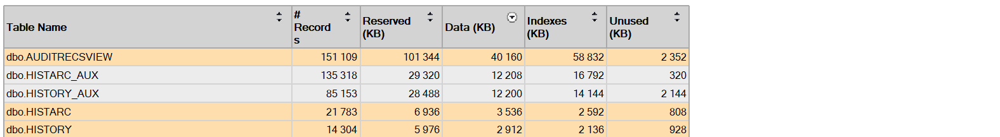
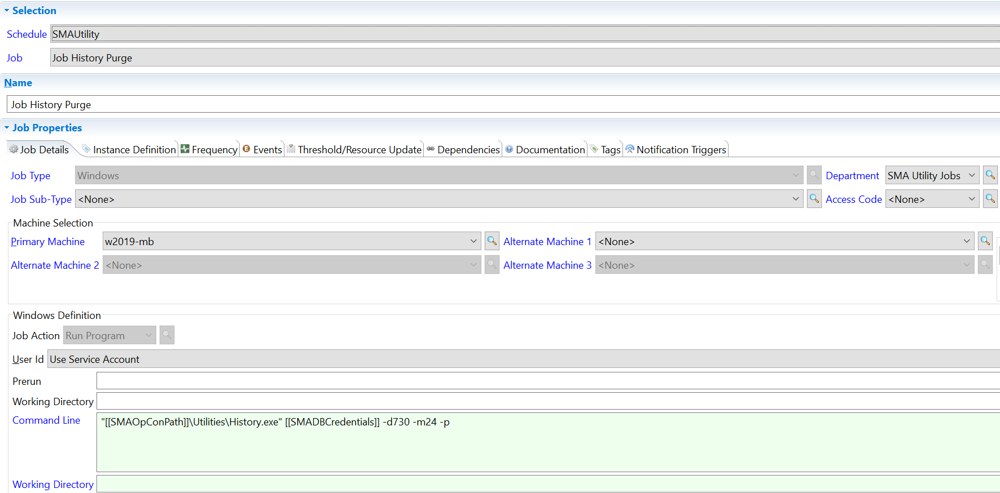

## OpCon Job History Management

OpCon stores information about the jobs that have run in its history. You have the ability to adjust the retention of the history at your convenience.

Let's understand first where are stored the data.

**Job History Data**

OpCon job history data are stored in the OpCon Database in multiple tables:

Data are stored in two different ways:

* Everything is in **HISTORY** and **HISTORY_AUX** tables
* Recent history is stored in HISTORY and **HISTORY_AUX** and the remaining data are archived in **HISTARC** and **HISTARC_AUX**

:::info Note 
"**_AUX**" tables are linked to the tables with the same prefixes, these tables contain accurate data such as command line or job parameters.
In large environments, **HISTORY** tables are the largest in size and you may want to reduce the amount of data collected and stored or you may just want to refine your retention.

:::

**Job History Purge**

Job History Purge is a job provided by SMA in the **SMAUtility** schedule that manage OpCon job history.

From this job, you can manage the behavior of the History program through the parameters you'll send. As mentioned previously, you may want to modify the settings of this job for multiple reasons:

* History is taking too much place on the SQL Database (following the case, reducing the history may increase performances)
* You may have to change the retention following your needs : i.e. you're audited on x months/years of data.
* For optimization purpose, you don't have special needs but you only want to optimize your OpCon environment by reducing the disk space consumed with the default history settings.

About the parameters :

* `-d`: this parameter means you're keeping 730 days (in the screenshot above) of job history = 2 years
* `-m`: this one means you're keeping a minimum of 24 occurrences of a job in your history, this parameter has the priority over the previous one. For example, if you've a job that is running only 6 times a year, you'll always keep 4 years of history for this job to match the 24 minimum occurrences.
* `-p`: this means that you're purging the HISTARC (and HISTARC_AUX) tables.
* `-h`: this means that you're purging the HISTORY (and HISTORY_AUX) tables.

To change your history retention, you only need to modify "`-d`" or "`-m`".

:::info Note 

If you're not using archive, you have both `-h` and `-p` on the "**Job History Purge**" which mean you don't archive and you purge directly **HISTORY** and **HISTORY_AUX**.

:::

We don't have a general Best Practice regarding OpCon history management - it depends of your needs and you preferences, some may need to keep only 6 months while some need to keep 1 or 2 years.

