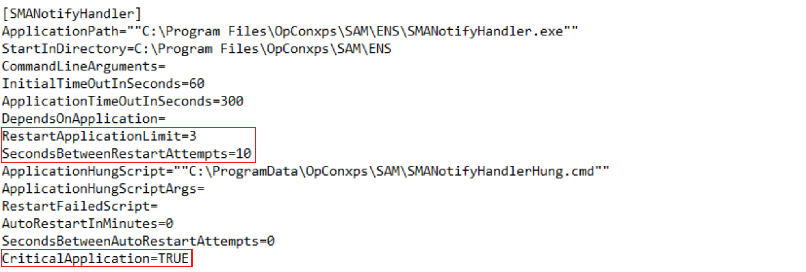

## OpCon Services and Processes

This article will introduce you to everything you need to know to have a basic understanding of **OpCon services and processes**. We'll review the different services and applications, what happen in case of failure and how OpCon manage itself an application failure.

**OpCon Services**

OpCon, some components and LSAMs operation are managed by services. It means that in order to start or to stop one of the component you need to start/stop the associated service.

The most important and critical service is "**SMA OpCon Service Manager**" also called "**ServMan**", it's the conductor of all the OpCon **key applications**. We'll see this in details in the next part of this article.

Others services are more or less critical depending on what you're using in your environment. If you're using the Solution Manager interface for example, the OpCon RestAPI needs to be running. If you're using Deploy to move schedules between your environments, Impex2 RestAPI also needs to be running.

Note : most services are in "**Automatic (Delayed Start)**" mode to let Windows environment load and to avoid any issues at the start up.

**OpCon Processes**

As reported previously, "**SMAServMan**" is like an orchestra conductor for OpCon processes and will start and handle every components needed by OpCon to run correctly.

**SMARequestRouter**: this process handles various requests to the OpCon database such as schedule build, delete, etc.

**SMANotifyHandler**: this process handles all the notifications sent by the notification manager.

**SMANetCom**: this process handles all the communication between OpCon and the agents.

**SMAStartTimeCalculator**: this component calculates the estimated start time for all the active jobs in the OpCon daily.

**SMALDAPMon (optional)**: this component checks the LDAP server to synchronize LDAP users with OpCon users.

:::info Note 
All these processes have their own log and configuration files located for a default installation in the C:\ProgramData\OpConxps\SAM folder (.ini files). The ServMan also has its own configuration file.

For more details about these processes: [Server Programs Introduction](https://help.smatechnologies.com/opcon/core/server-programs/introduction)

:::

**OpCon process failure**

* If a process encounter an issue and crashes, you may be able to find information here :
* In its own log file : for example if the **NotifyHandler** crashes, you will probably retrieve information in the **SMANotifyHandler.log**
* In the **SMAServMan.log**: a periodic check is performed on the different processes and their status is reported here. You will find here when the first issue occurs and eventually get some information.
* In the Windows Event Viewers: You may find something in the **Application/System** log files.

Test kill of the **NotifyHandler** process:

What happened when a process fails:

1. ServMan is reporting an unexpected shutdown of one of its application

2. Application's hung script is triggered

3. A mail is sent to inform that an application is down

4. ServMan restarts the application

5. If the application does not work, there will be up to 3 restarts (by default)

6. If the application still doesn't work:

    a. Critical : ServMan will initiate a complete shutdown of OpCon

    b. Non-critical : ServMan will stop restart process and it will continue to work

**OpCon ServMan configuration**

It is possible to customize the behavior of the ServMan through its .ini file (`C:\ProgramData\OpConxps\SAM` for a default install). The **SMAServMan.ini** configuration file allows to apply different settings for every applications.

The list of applications allows us to decide if the ServMan starts a specific application or not:

The application settings, for example **SMANotifyHandler**, allows us to customize how to react when a fail occurs:

* **RestartApplicationLimit**: How many time the application will try to restart if failed.

* **SecondsBetweenRestartAttempts**: By default 10 seconds between each attempts.

* **CriticalApplication**: True or False, defines if OpCon can or cannot run without this application.

:::info Note 

By default, the **SMASmartTimeCalculator** and the **SMALDAPMon** critical setting is "**False**" because these process aren't necessary for OpCon to run correctly and will have a "limited" impact. 

The **NotifyHandler** is set as critical by default but you can decide whether you want OpCon to stop if it does no longer send notifications or not. 

You have to restart manually the SMA ServMan service manually in order to restart a non-critical stopped processes.

:::