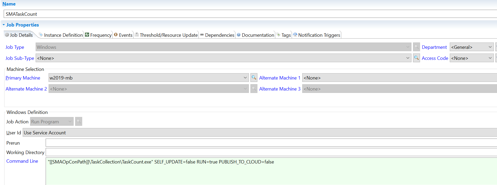

## OpCon Task Usage Utility Installation and Configuration

**Prerequisite**

* This utility requires **OpCon version 18.1 or above**.

* **Dockerbase.zip** or **Winbase.zip** following your installation (.zip files are attached to this article).

**If you are on Windows**

* Create a folder named "**TaskCollection**" at the same level as "SAM" installation folder within OpCon installation. Unzip the winbase.zip archive to that folder.

* E.g. locations - `C:\Program Files\OpConxps\TaskCollection`, or `D:\MyAPplications\OpConxps\TaskCollection`

* Create a folder named "**TaskCollection**" in the "ProgramData" folder for OpCon at the same level as "SAM". Copy the downloaded "**Executables.json**" file into that folder.

* E.g. location - `C:\ProgramData\OpConxps\TaskCollection` 

**If you are on Docker**

* Unzip the dockerbase.zip archive to a folder named "**TaskCollection**" on the host machine.

* From one level above this folder, use `docker cp TaskCollection <container_name>:/app` to copy the application to the container.

* Alternatively, you may map the above folder to the container when starting your container (if OpCon is not yet running). E.g.: "`docker run ... -v C:\OpCon\TaskCollection:/app/TaskCollection ...`"

* E.g. location - `/app/TaskCollection`

* Copy the downloaded "**Executables.json**" file into `/app/TaskCollection`.

**Instructions**

* Once downloaded and extracted, open a command prompt to the "**TaskCollection**" folder on Windows and run "**TaskCount.exe**", which runs and creates a schedule "S**MATaskCollection**" and a single job in it "**SMATaskCount**".

* Alternatively, you may double-click the EXE, which does the same. However, please note that if there are any errors, they are output to the console, and may not be visible, if you double-click.

* When run without any arguments, the utility creates the auto-built schedule and job with all default settings. You may choose to have different settings given below.

* **If you get an error at the first run, try to run `TaskCount.exe SELF_UPDATE=False`**

* Please note that the job's command line uses a global property called "`[[SMAOpConPath]]`", which must exist and should have the path to the root OpCon folder, like `C:\Program Files\OpConxps`.

* When running on Docker, enter the container and go to `/app/TaskCollection` and then run "**TaskCount**" from the prompt to use defaults to set up the schedule and job.

**Settings**

You may provide arguments to the utility when running it for the first time from the command prompt. These settings will be applied to the job created.

* **SELF_UPDATE**: This argument specifies if the application should update itself if a new version is available on GitHub, before running (Default "True"). E.g.: TaskCount.exe SELF_UPDATE=True

* **PUBLISH_TO_CLOUD**: This argument specifies if the task counts should be published to the Azure SQL Database (Default "True"). E.g.: TaskCount.exe PUBLISH_TO_CLOUD=False

* **PUBLISH_LOCAL**: This argument specifies if the task counts should be published to a local JSON file (Default "True"). E.g.: TaskCount.exe PUBLISH_LOCAL=True

* **PUBLISH_FREQUENCY**: This argument specifies the frequency of the job (Default "Daily"). E.g.: TaskCount.exe PUBLISH_FREQUENCY=Weekly

* **MACHINE_NAME**: This argument applies only when setting up the job. This is the OpCon machine name that will be used to run the job (it must be an agent for the local machine where SAM is running). By default the application searches the database for a machine with IP=127.0.0.1, or the local machine's IP or the local machine's fully qualifixed domain name (FQDN).

**Frequency**

By default the frequency is in "**Do not schedule**". Change this for "**Released**". The job has its own frequency and will run daily.

**Server with limited or no connectivity**

* The default command line for the job specifies the path to the exe and the `RUN=true` command. 

* If you are operating the utility on an OpCon server that has restricted access to Github, then you can disable the update check by adding `SELF_UPDATE=False` after `RUN=true:`

* `"[[SMAOpConPath]]\TaskCollection\TaskCount.exe" RUN=true SELF_UPDATE=False`

* If your environment also restricts access to our Azure cloud server where the data is stored, you can disable that feature by adding `PUBLISH_TO_CLOUD=False` to the command line:

* `"[[SMAOpConPath]]\TaskCollection\TaskCount.exe" RUN=true PUBLISH_TO_CLOUD=False`

* When `PUBLISH_TO_CLOUD` is set to false, the results will only be published to a **local JSON** file that can be emailed to usage@smatechnologies.com. If your OpCon server is able to send a notification to an email server, then you could add a `$NOTIFY:EMAIL` Event to the job to send the file automatically when the job Finishes OK using the following event template:

* `$NOTIFY:EMAIL,usage@smatechnologies.com,,,OpCon Usage Data,Usage Data Attached,"C:\ProgramData\OpConxps\TaskCollection\TaskCount.json"`,

:::info Note 

Please note that port 443 must be open in order for the `SELF_UPDATE` and `PUBLISH_TO CLOUD` features to be able to communicate and function properly.

:::

For more information, please check [SMA Technology Innovations Lab](https://github.com/smatechnologies/usage-data)