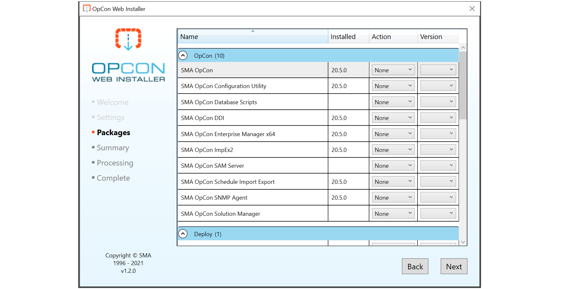

## OpCon Web Installer (OWI)

The OpCon Web Installer (OWI) is a tool designed to make the process of installing and maintaining OpCon software easier. It has the ability to connect to the public distribution location of OpCon software automatically and download or install selected product components.

[SMA Technology Innovations Lab](https://github.com/smatechnologies/opcon-web-installer)

