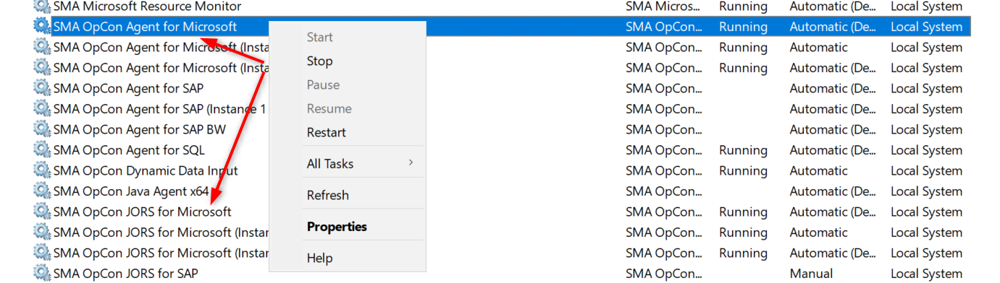
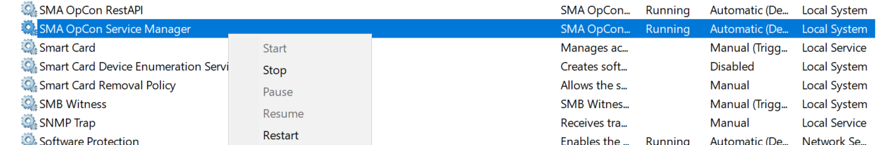

## Restart OpCon/LSAM Server

You may have to restart a server hosting **OpCon** or an **LSAM** for **maintenance** or **upgrade** purpose. As the scheduler is always a key product in the company, the restart process can be a really sensitive and stressful operation.

This article will help you by providing guidelines and tips to stop and restart your LSAM or OpCon environment without causing damages.

**Server hosting at least one LSAM**

The first step is to stop the job submission to the **LSAM**: 

You can right-click on the machine and then "Disable Job Starts". The machine will be in a "Limited" status where the running jobs will run until they are finished and no new jobs will be submitted to the machine. This state is useful for a transition before a restart.
The machine is in a "Limited" status and 1 job is still **running**.

The job is now finished and the machine will not receive jobs anymore until we reactive the job submission. As we no longer have running jobs, we can now proceed to the next step.

In the next step, we stop the agent service(s). In this example, the **MSLSAM** has 2 services but another LSAM could have only one service (SQL Agent for example):

When your services are stopped, you're free to restart the server. The LSAM shut down was performed appropriately so you avoid any side effects on the tracking files for example when you perform an hard reboot where jobs were still running.

After the restart of your server, the services will restart automatically as defined in the startup type (Automatic or Automatic Delayed). On the Enterprise Manager, you'll just have to reactive the job submission : right-click on the machine and select "Enable Job Starts".

**Server hosting OpCon environment** 

You may have to restart the server hosting **OpCon** for maintenance, upgrade or security purpose. We'll consider it's a simple environment with only a Production server without a failover. Before restarting your Production server, please understand how his managed your server: *SQL Clustering*, *SMA Failover*, *automatic failover*, *etc.*

The best practice is to perform the restart when the load is at the lowest point of the day if you don't have a time window where nothing is running.

You can repeat the same step as for the LSAM server restart where you can put your machines in a "Limited" status to let the jobs finish without submitting new ones.

When you consider the load is low on your environment, you can stop the service **SMA OpCon Service Manager**:

At this point, nothing will move on your OpCon server. If jobs are still running on agents on other machines, they'll keep running and will store the information in the tracking files waiting to retrieve the communication with the OpCon server through the **SMANetCom**.

**Check OpCon status after restart**

After the restart process, you may want to check that OpCon and all the processes are running correctly. Here are few items you can check to see if everything is running without troubles:

* SAM.log - general OpCon SAM log file
* Critical.log - all critical issues are logged in this file
* SMAServMan.log - log the OpCon processes status

Example of a new SMAServMan.log:

Processes are started (SMANetCom, SMAStartTimeCalculator, etc.) with success and are running.