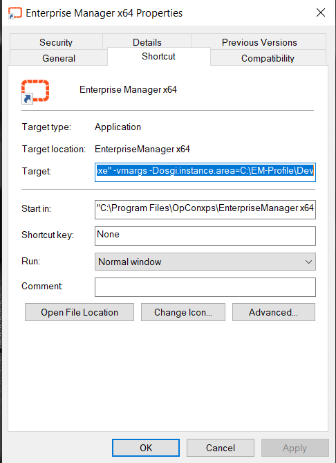

## Running EM From a Non-Standard Location

Usually, as default the profiles are all listed together in one profiles.xml file in the location similar to this, `C:\Users\Username\.enterpriseManager\profiles.xml`

But the Enterprise Manager can look for the profile.xml in a different location providing the location is set up on the EM’s shortcut.

**How to proceed**

As an example for multiple locations, you could setup something similar to this on the User’s machine:

`C:\EM-Profile\Dev`

`C:\EM-Profile\PreProd`

`C:\EM-Profile\Prod`

Then create 3 **shortcuts** and have each shortcut pointing to the three **different** profile locations. The short cut commands would look like this:

`“C:\Program Files\OpConxps\EnterpriseManager\Enterprise.exe” -vmargs -Dosgi.instance.area=C:\EM-Profile\Dev`

`“C:\Program Files\OpConxps\EnterpriseManager\Enterprise.exe” -vmargs -Dosgi.instance.area=C:\EM-Profile\PreProd`

`“C:\Program Files\OpConxps\EnterpriseManager\Enterprise.exe” -vmargs -Dosgi.instance.area=C:\EM-Profile\Prod`

That assumes the EM is installed on the C drive. If not installed on the C drive make the necessary corrections to the path according to the User’s environment.

Once the shortcuts are ready, login to each and create the profile that is required for each environment. So, for the shortcut pointing to the DEV environment create the profile that will access the DEV database etc.

Below is a screenshot of an EM shortcut setup with the Target modified as per the first example listed above.

