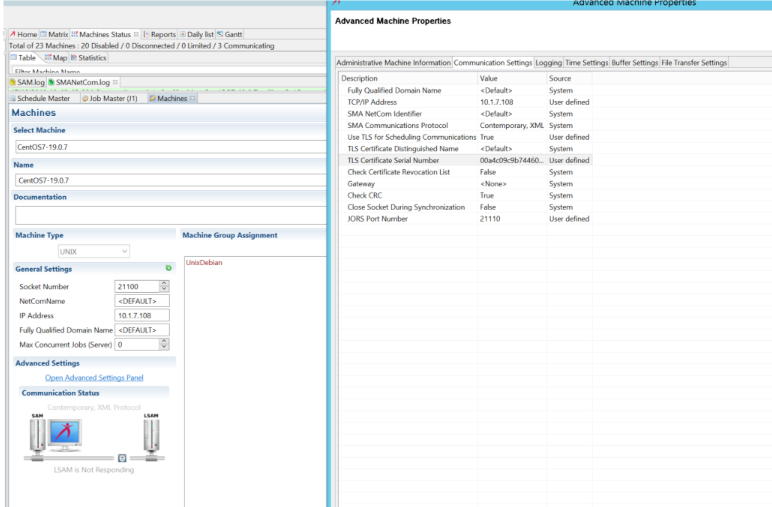

## Set Up Secure TLS Communication With UNIX LSAM

This article will show you **how to set** the **TLS communication** for your **UNIX LSAM**, this feature is only available for a UNIX LSAM installed with a **tar file suffixed** by `*_SSL.tar`

All screenshots in this article come from a CentOS system, UNIX LSAM LSAM_19.0.7_Redhat_RHEL6.1_64_SSL.tar, Windows Server 2012 R2 (for the windows part), and here LSAM is using port 21100 (3100 is usually the default port).

We'll use in this example an **auto signed certificate**.

**Create the certificate**

Open a putty connection or a ssh connection to reach your Unix/Linux terminal :

```

cd /usr/local/lsam-19.0.7
cd bin
./lsam21100 create_cert (By default 365 but we can go until 3650):
[root@CentOS-BEN bin]# ./lsam21100 create_cert
Generating self-signed certificate CentOS-BEN.globalsma.com.pem valid for 365 days
Generating a 2048 bit RSA private key
...........................+++
..........+++
writing new private key to 'CentOS-BEN.globalsma.com.pem'
-----
You are about to be asked to enter information that will be incorporated
into your certificate request.
What you are about to enter is what is called a Distinguished Name or a DN.
There are quite a few fields but you can leave some blank
For some fields there will be a default value,
If you enter '.', the field will be left blank.
-----
Country Name (2 letter code) [XX]:FR
State or Province Name (full name) []:LO
Locality Name (eg, city) [Default City]:NCY
Organization Name (eg, company) [Default Company Ltd]:SMA
Organizational Unit Name (eg, section) []:Support
Common Name (eg, your name or your server's hostname) []:CentOS-BEN (important : hostname, fqdn, or generic like *.globalsma.com)
Email Address []:bbernard@smatechnologies.com
CentOS-BEN.globalsma.com.pem successfully created.
 
Exporting CentOS-BEN.globalsma.com.pem to Windows format PKCS#12 file CentOS-BEN.globalsma.com.pfx
Enter Export Password:
Verifying - Enter Export Password:
CentOS-BEN.globalsma.com.pfx successfully created.

``` 

**Configure your UNIX LSAM**

```

[root@CentOS-BEN bin]# ./lsam21100 config
Configuring the LSAM services:
Checking current configuration file (/usr/local/lsam-19.0.7/config/21100/lsam.conf)...
 
 
       1) TCP/IP configuration parameters
       2) Lsam Configuration Parameters
       3) Logging configuration parameters
       4) Dispatcher configuration parameters
       5) JORS and SMAFT parameters
       6) sma_filein parameters
       7) Trace option parameters
       8) Blacklist parameters
       9) Whitelist parameters
       10) SFTP parameters
       11) FAD parameters
 
       s) Save changes
 
       q) Quit
 
               Enter choice -> 1
 
 
       Enter allowed_sam_ip_address_1      [any] :
       Enter allowed_sam_ip_address_2      [unused] :
       Enter allowed_sam_ip_address_3      [unused] :
       Enter allowed_sam_ip_address_4      [unused] :
       Enter allowed_sam_ip_address_5      [unused] :
       Enter bound_NIC_adapter_ip          [default] :
       Enter use_TLS_SAM (0=no, 1=yes)     [0] : 1
       Enter lsam_pem_file (full pathname) [none] : /usr/local/lsam-19.0.7/ssl/CentOS-BEN.globalsma.com.pem
       Enter lsam_private_key_file         [none] : /usr/local/lsam-19.0.7/ssl/CentOS-BEN.globalsma.com.pem
       Enter netcom_pem_file               [none] :

```

*Change the **port** of the **SMAFT** on the option **5** of the **list menu** because SMAFT cannot have the same port than the JORS in TLS mode enabled.*

Then **save** and **quit**.

(**Certificate** files here are in a ssl folder, ***by default*** they are created in bin directory)
 
**On Windows side**

**Copy** the **pfx file** on your **OpCon server**

**Save** the pfx on your server by **double-clicking** on it:


Then type **next**, and type the **password** of your private key:


Type **next**, and **store** your certificate to the **Trusted Root Certification Authorities**: 


At the end you should get a message to confirm the import of your certificate.
 
Now, go to the **certificate manager**:


Once opened, expend the **Trusted Root Certification Authorities**:


**Find** and **select** your **certificate** and open it by double clicking on it

In the **details tab** you will find the **serial number**, keep it aside:


Go to the **Enterprise Manager**, **Machines**, select y**our machine, put down the communication** if it is enabled, Open **advanced settings**, **communication settings** tabs:



Set **Use TLS for Scheduling Communications** to **true**

Set **TLS Certificate Serial Number** with the **serial number** we found on step above

**Update** and **save**.

**Restart your UNIX agent ./lsam21100 restart**

```

Starting LSAM services on port=21100 with LSAM_instance=21100. SMA VERSION= 19.0.7 SSL-capable
 
Pre-start validation completed.
 
--- Starting logging daemon
sma_log - PID file (/usr/local/lsam-19.0.7/pid/21100/sma_log.pid) successfully created.
--- Starting lsam daemon
sma_lsam - PID file (/usr/local/lsam-19.0.7/pid/21100/sma_lsam.pid) successfully created.
***** This LSAM supports IPV6.
--- Starting dispatcher daemon
sma_disp - PID file (/usr/local/lsam-19.0.7/pid/21100/sma_disp.pid) successfully created.
***** LSAM health monitor started...
--- Starting CronMon
sma_cronmon - PID file (/usr/local/lsam-19.0.7/pid/21100/sma_cronmon.pid) successfully created.
--- Starting Filein
sma_filein - PID file (/usr/local/lsam-19.0.7/pid/21100/sma_filein.pid) successfully created.
--- Starting sma_JORS
sma_JORS - PID file (/usr/local/lsam-19.0.7/pid/21100/sma_JORS.pid) successfully created.
--- No SMA_RM Config File found -- not starting SMA_RM
--- No config files specified for the FAD. Exiting...
 
LSAM started at Tue Dec 17 10:50:50 EST 2019

```

Go back to the Enterprise Manager and **start the communication of your machine**, it should be up, and **check the SMANetcom log**, the log should display:

```

17/12/2019 16:51:56:404
 
 
**********************************************************
                  Configuration Parameters Loaded For [CentOS7-19.0.7]
                   General
                                      Fully Qualified Domain Name = <Default>
                                     *TCP/IP Address = 10.1.7.108 (<Default>)
                                      OS Type = UNIX
                                      SMA NetCom Identifier = <Default>
                                      SMA Communications Protocol = Contemporary, XML
                                     *Use TLS For Scheduling Communications = TRUE (FALSE)
                                      Check Certification Revocation = FALSE
                                     *Server TLS Certificate Serial Number = 00a4c09c9b7446048b (NONE)
                                      LSAM Gateway Name = <None>
                                      LSAM Max Jobs = 50
                                      LSAM Current Jobs = 0
                                     *JORS Port Number = 21110 (0)
                                      Check CRC = TRUE
                                      Close Socket During Synchronization = FALSE
                                     *Allow "Kill Job" = TRUE (FALSE)
                                      Requires XML Escape Sequences = FALSE
                                     *Supports Handshake Messages when idle = TRUE (FALSE)
                                     *LSAM Socket Number = 21100 (3100)
                                      LSAMConnectionMarkedUp = TRUE
                                      LSAMConnectionMarkedLimited = FALSE
                   Logging
                                      LSAMTraceAllMessages = TRUE
                   Time Settings
                                      Time Zone Name = UNKNOWN
                                      Time Offset From UTC (Hours) = 1.00
                                      Connection Attempt Timeout (ms) = 1000
                                      Poll Interval (ms) = 1000
                                      Check Machine Status (sec) = 120
                                      Response Timeout (sec) = 30
                                      Consecutive Send Sleep Time (ms) = 100
                   Buffer Settings
                                      Max Consecutive Send Messages = 100
                                      Send Buffer Count = 25
                                      Receive Buffer Count = 25
                   File Transfer Settings
                                     *File Transfer Role = T (N)
                                     *File Transfer Port Number = 18110 (0)
                                     *Full File Transfer Support = TRUE (FALSE)
 17/12/2019 16:51:56:404 Connection exists for Machine CentOS7-19.0.7 calling SetConnectionParams
17/12/2019 16:51:56:404 This is a TLS socket, calling ProcessClient
17/12/2019 16:51:56:420 Server Certificate with Serial Number 00a4c09c9b7446048b found for ServerName : CentOS-BEN
17/12/2019 16:51:56:420 Authenticating with serverName = CentOS-BEN
17/12/2019 16:51:56:436 Server's authentication succeeded ...
17/12/2019 16:51:56:436 Cipher: Aes256 strength 256
17/12/2019 16:51:56:436 Hash: Sha384 strength 0
17/12/2019 16:51:56:436 Key exchange: RsaKeyX strength 2048
17/12/2019 16:51:56:436 Protocol: Tls12
17/12/2019 16:51:56:436 Is authenticated: True as server? False
17/12/2019 16:51:56:451 IsSigned: True
17/12/2019 16:51:56:451 Is Encrypted: True
17/12/2019 16:51:56:451 Certificate revocation list checked: False
17/12/2019 16:51:56:451 Local certificate is null.
17/12/2019 16:51:56:451 Remote cert was issued to E=bbernard@smatechnologies.com, CN=CentOS-BEN, OU=Support, O=SMA, L=NCY, S=LO, C=FR and is valid from 17/12/2019 16:29:11 until 16/12/2020 16:29:11
17/12/2019 16:51:56:451 Can read: True, write True
17/12/2019 16:51:56:451 Can timeout: True
17/12/2019 16:51:56:451 ***** Established a connection to [CentOS7-19.0.7] (10.1.7.108). It will be sending and receiving data. If succeeds, the machine will be marked up.
17/12/2019 16:51:56:467 ***** The machine [CentOS7-19.0.7] is marked up successfully.
 17/12/2019 16:51:56:905
 
 
**********************************************************
                  Configuration Parameters Loaded For [CentOS7-19.0.7]
                   General
                                      Fully Qualified Domain Name = <Default>
                                     *TCP/IP Address = 10.1.7.108 (<Default>)
                                      OS Type = UNIX
                                      SMA NetCom Identifier = <Default>
                                      SMA Communications Protocol = Contemporary, XML
                                     *Use TLS For Scheduling Communications = TRUE (FALSE)
                                      Check Certification Revocation = FALSE
                                     *Server TLS Certificate Serial Number = 00a4c09c9b7446048b (NONE)
                                      LSAM Gateway Name = <None>
                                      LSAM Max Jobs = 50
                                      LSAM Current Jobs = 0
                                     *JORS Port Number = 21110 (0)
                                      Check CRC = TRUE
                                      Close Socket During Synchronization = FALSE
                                     *Allow "Kill Job" = TRUE (FALSE)
                                      Requires XML Escape Sequences = FALSE
                                     *Supports Handshake Messages when idle = TRUE (FALSE)
                                     *LSAM Socket Number = 21100 (3100)
                                      LSAMConnectionMarkedUp = TRUE
                                      LSAMConnectionMarkedLimited = FALSE
                   Logging
                                      LSAMTraceAllMessages = TRUE
                   Time Settings
                                      Time Zone Name = America/Detroit
                                      Time Offset From UTC (Hours) = -5.00
                                      Connection Attempt Timeout (ms) = 1000
                                      Poll Interval (ms) = 1000
                                      Check Machine Status (sec) = 120
                                      Response Timeout (sec) = 30
                                      Consecutive Send Sleep Time (ms) = 100
                   Buffer Settings
                                      Max Consecutive Send Messages = 100
                                      Send Buffer Count = 25
                                      Receive Buffer Count = 25
                   File Transfer Settings
                                     *File Transfer Role = T (N)
                                     *File Transfer Port Number = 18110 (0)
                                     *Full File Transfer Support = TRUE (FALSE)
 17/12/2019 16:51:56:905 Connection exists for Machine CentOS7-19.0.7 calling SetConnectionParams

 ```

*If you want to set a signed certificate this procedure is still valid as it shows where required options and fields are required for the TLS.*