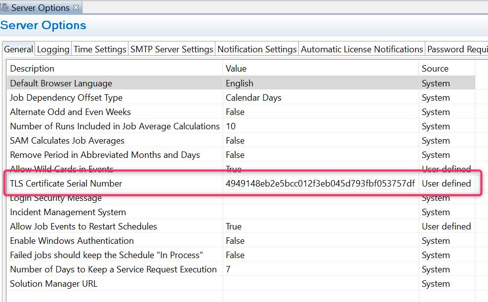

## Set Up Secure TLS Communication With Windows Agent

This article will show you **how to set the TLS communication** for your Windows Agent, this feature is available for all Windows Agent version higher than 17.1.


All screenshots in this article come from a Windows Server 2019, MSLSAM 19.1, and here the MLSAM is using port 3100 (3100 is the default port).
Here we'll use an **auto signed certificate**.

**Create the certificate**

Before to go further, you need to **create a certificate** (auto-signed or signed).

We won't show in this article how to create a certificate, you can use OpenSSL commands or the available function in IIS.

**Import a certificate** into the certificate manager of the **Opcon server** and into the **server hosting the Windows Agent**.

* On the OpCon server get the certificate and execute it by double-clicking on it


* Choose a local computer:


* Click Next


* Type the Private Key of your certificate


* Choose where to store your certificate: **Trusted Root Certification Authorities**


* Finish

If the Windows Agent run on a different server of the OpCon server duplicate steps above on the other server.

**Certificate serial number**

For the next steps you need to know the serial number of your certificate, below how to get it

* Start the **certificate manager** (certlm.msc)


* Go on **Trusted Root Certification Authorities\Certificates**


* Once you identified your certificate, right click on it, properties and Details tab

* Find serial number and keep it


**Enterprise Manager and MSLSAM.ini set up**

As you found the serial number of your certificate, you need to fill out the **MSLSAM.ini** to let your agent know which certificate to use:

* In the **MSLSAM.ini** edit these parameters: **"UseSecureSocket"** to **TRUE** and **"TLSCertificateSerial"** with the **certificate serial number** you found.

:::caution 

A copy/paste of the serial number directly from the certificate store could include invisible special characters thus making the MSLSAM services impossible to start because the certificate is not found. Please write the serial number instead of a copy/paste. If you're encountering the issue above, remove the TLSCertificateSerial line and rewrite the line manually.

:::


* Change the SMAFT port as with TLS enables **JORS** and **SMAFT cannot** have the **same port number**


* **Restart the Windows agent and the JORS service** to apply the change

* Now in the **Enterprise Manager** on the **Advanced Machine Properties** edit these lines like below


* Once all is set, you can **start** the **communication** of your machine.

**Verification**

After you started the communication of your machine in the Enterprise Manager, check the log **MSLSAM.log** and **SMANetcom.log**


* The **SMANetcom** encrypt all data and check the Windows Agent identity


At this moment your agent use an encrypted flow through your certificate

**Client validation**

To go further, you can also allow the **client verification**, the LSAM (as TLS server) will validate the certificate presented by the OpCon server's SMANetCom program (as TLS client).

* To allow the Windows Agent to verify the OpCon server identity, we need to edit the parameter **TLSClientValidation=TRUE** in the **MSLSAM.ini**

* Once done r**estart Windows Agent services**

* In the **Enterprise Manager** -> **Server Options** add the serial number at the line **TLS Certificate Serial Number**:



* **Save** and **Restart SMA OpCon Service Manager**

**Verification**

* Check Windows Agent Log:

```

04/02/2021 15:03:43.134  Local cert was issued to E=bbernard@smatechnologies.com, CN=WS2019-BB20, O=SMA, L=Houston, C=US and is valid from 01/02/2021 18:04:02 until 01/02/2022 18:04:02
04/02/2021 15:03:43.134  Remote cert was issued to E=bbernard@smatechnologies.com, CN=WS2019-BB20, O=SMA, L=Houston, C=US and is valid from 01/02/2021 18:04:02 until 01/02/2022 18:04:02
04/02/2021 15:03:43.134  Can read: True, write True
04/02/2021 15:03:43.134  Can timeout: True
04/02/2021 15:03:43.248  Connection accepted. 0 : [ ::ffff:192.168.1.86 ]

```

* Check the SMANetcom.log


