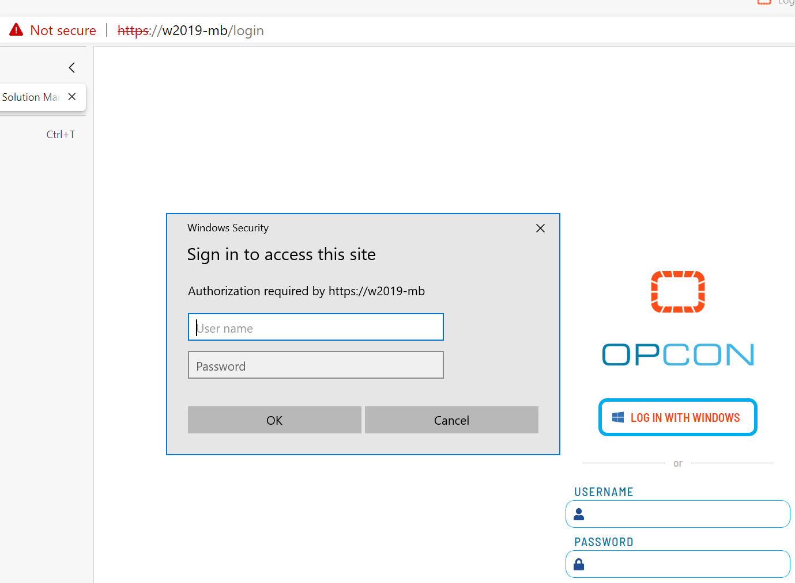
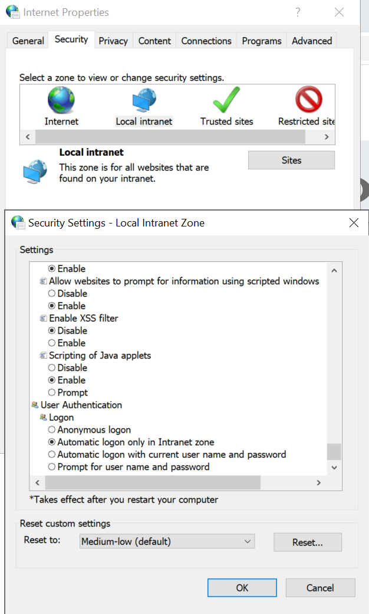
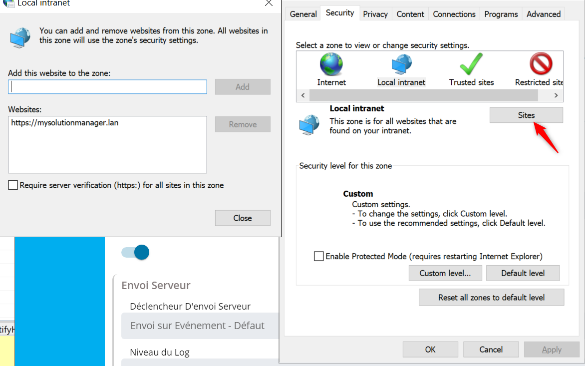
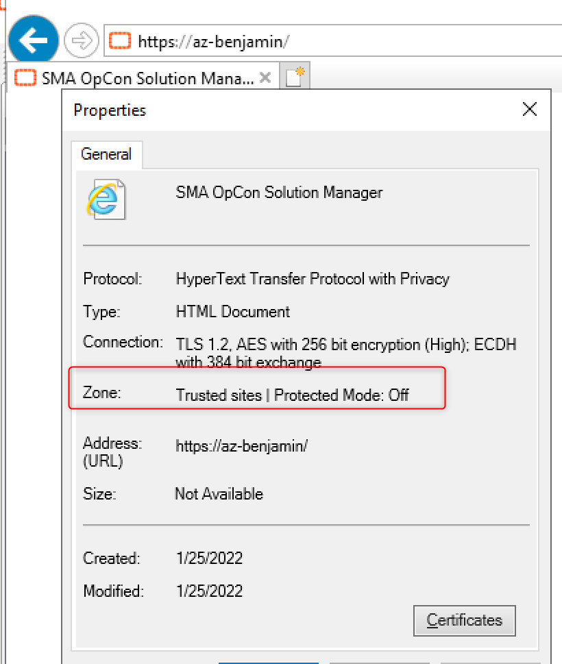

## Solution Manager Windows Authentication Required

This article will show how we can solve for the **Solution Manager** the **Windows Authentication** popup for web browsers (Edge, Chrome, etc.)

**What is the issue ?**

The issue in on the Windows Authentication popup displayed by the web browser. Usually it comes from a bad configuration of the **internet options** of your machine/server.

To avoid this popup and have the Windows Authentication working as expected, (without getting the popup every time), you have to edit your **Internet Options**.

**You'll need to configure the Internet Options on each environment where you access the Solution Manager.**

In the search bar, enter **Internet Options**, then go to the **Security** tab, select **Local Intranet**, **Custom Level**:

Check the radio button **Automatic Logon Only in Intranet zone or Automatic Logon with curent user name and password** (both are Ok), actually we **should not have prompt for user name and password**.
Then add the solution manager URL to the **local Intranet site** to allow this URL to use the allowed Security for this Zone (see below):

Following your configuration you may also have to do the same but on the **Trusted Sites Zone**.
For **troubleshooting purpose** and to make sure you are configuring the **correct zone**, you can use **Internet Explorer**.

Open Internet Explorer, go to the Solution Manager URL, then you will probably get a blank page as IE is no more supported.

It doesn't matter if the page is blank or not, apply a **right click** somewhere on the page, and **Properties**.

It will show off the Zone for this web site, see below:

As a reminder we also give you some indications in the web documentation (OpCon) : SMA Technologies Online Help

In the documentation, navigate to **User Interfaces -> Solution Manager -> Logging In/Out**