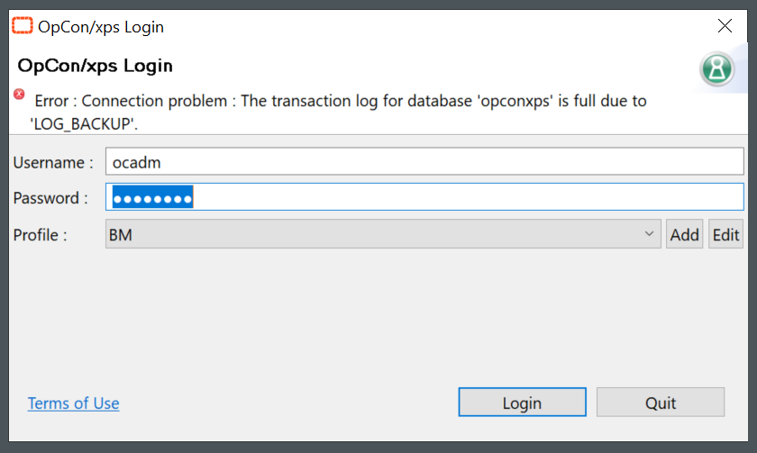
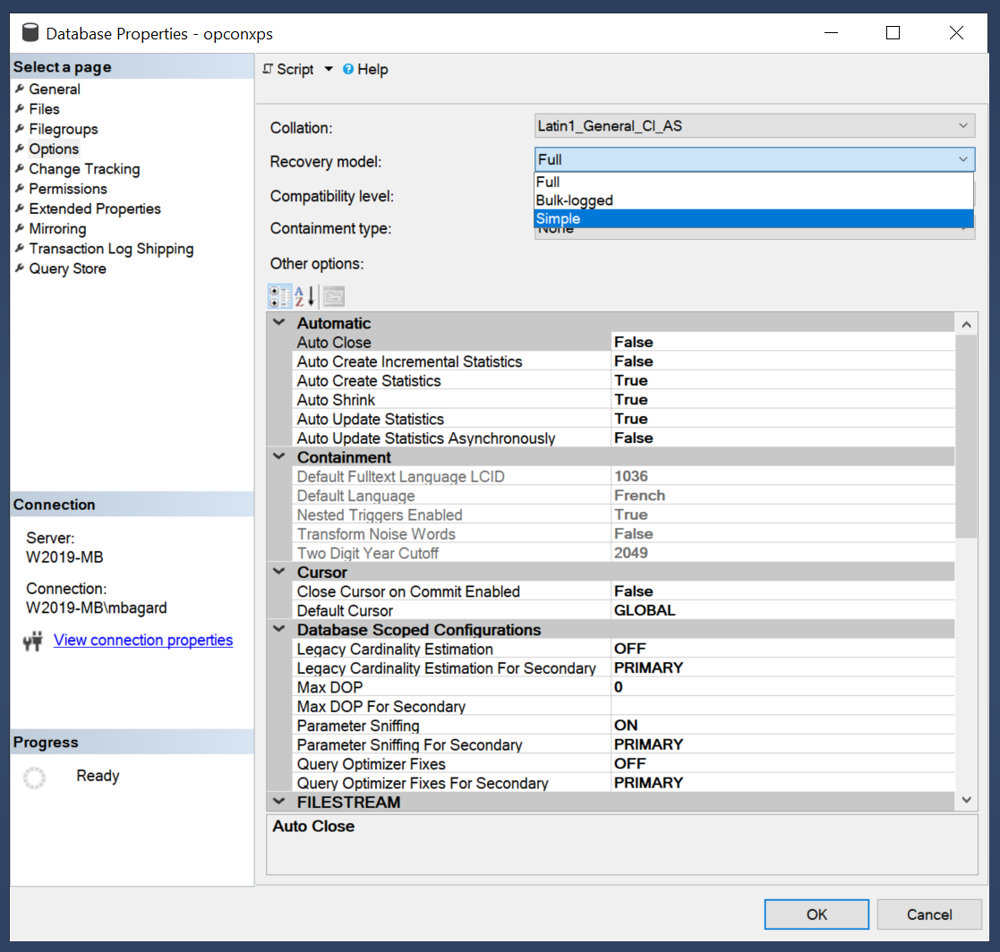
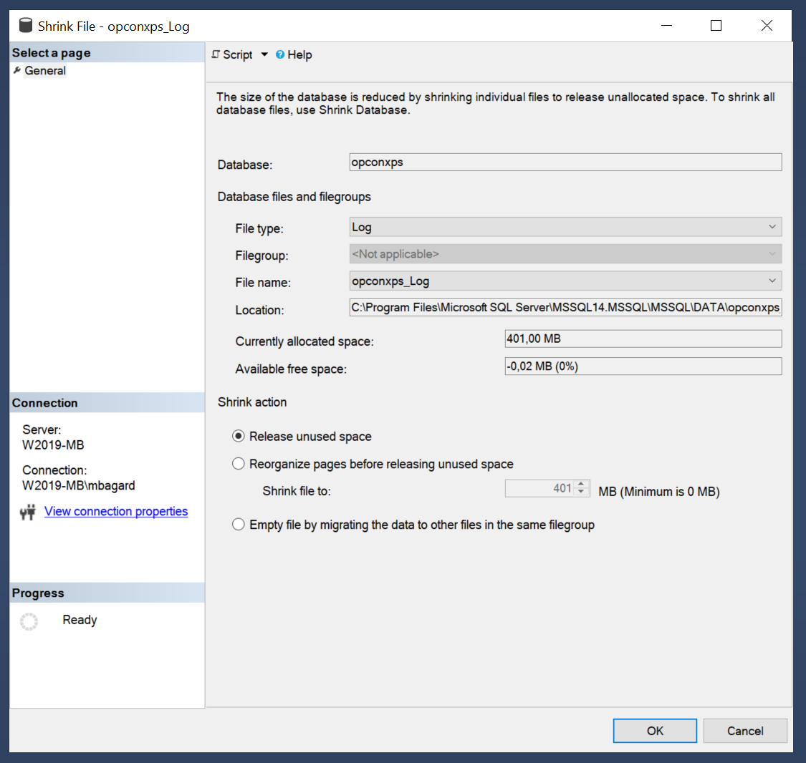
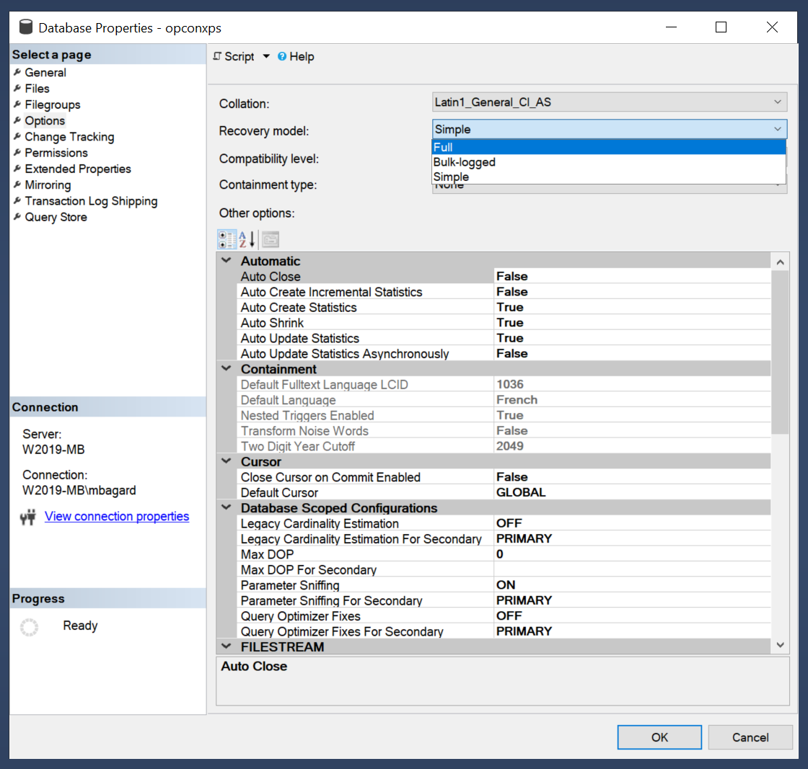
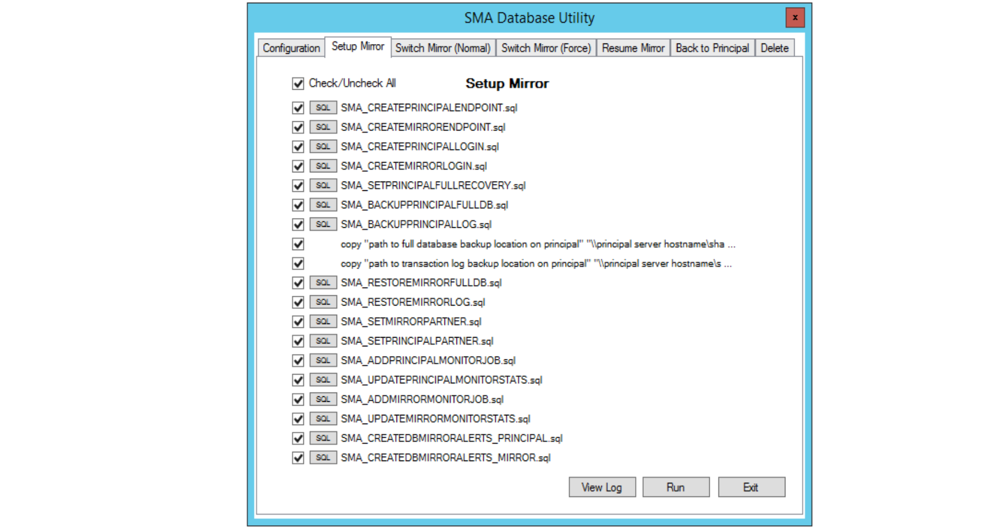

## Transaction Log Full

**Transaction Log Full - for non replicated/mirrored environment only!**

*This article is designed for an environment without mirror or replication as you may have set up your own system. For SMADBMirror users, please read the note at the end for instructions.*

If you can't connect to your **Enterprise Manager** and you're seeing this error message in the OpCon/xps Login screen: 



Then you're on the right article. You'll find below a step by step process you can follow in order to shrink correctly the Transaction log file.

**How to solve it**

Modification of the **Recovery Model**

1. Open a session on SQL Management Studio

2. Right-click on your OpCon Database

3. Navigate to Properties

4. In Options, set Recovery Model from Full to **Simple**



**Shrink** of the Log file 

1. Right-click on your OpCon Database

2. Navigate to Tasks > Shrink > Files

3. In the file type, select Log

4. Let the Shrink action to "Release unused space"

5. Click OK



Modification of the **Recovery Model**

1. Right-click on your OpCon Database

2. Navigate to Properties

3. In Options, change the Recovery Model from Simple to Full

4. **Restart** your service **SMA Service Manager**

5. Check that everything is ok in the log and that the server is correctly started



**To go further**

You'll find this kind of error in the Critical.log when the SQL Transaction Log are full :

```
9/20/2020 01:26:14.250  Error during SQL Connection Open for _Core. Error: SMACommon.SmaExceptions.AuditConnectionException: The transaction log for database 'OPCONXPS' is full due to 'LOG_BACKUP'. ---> System.Data.SqlClient.SqlException: The transaction log for database 'OPCONXPS' is full due to 'LOG_BACKUP'.
  at System.Data.SqlClient.SqlConnection.OnError(SqlException exception, Boolean breakConnection, Action`1 wrapCloseInAction)
  at System.Data.SqlClient.TdsParser.ThrowExceptionAndWarning(TdsParserStateObject stateObj, Boolean callerHasConnectionLock, Boolean asyncClose)
  at System.Data.SqlClient.TdsParser.TryRun(RunBehavior runBehavior, SqlCommand cmdHandler, SqlDataReader dataStream, BulkCopySimpleResultSet bulkCopyHandler, TdsParserStateObject stateObj, Boolean& dataReady)
  at System.Data.SqlClient.SqlCommand.RunExecuteNonQueryTds(String methodName, Boolean async, Int32 timeout, Boolean asyncWrite)
  at System.Data.SqlClient.SqlCommand.InternalExecuteNonQuery(TaskCompletionSource`1 completion, String methodName, Boolean sendToPipe, Int32 timeout, Boolean& usedCache, Boolean asyncWrite, Boolean inRetry)
  at System.Data.SqlClient.SqlCommand.ExecuteNonQuery()
  at SMADataAccess.SmaConnection.ExecuteAuditStoredProc(String storedProc, String storedProcParams)
  --- End of inner exception stack trace ---
```

**Why this error?**

All the DB transactions are logged into this file, this may happen when the size is restricted and the file cannot growth or when the **SMAUtility** schedule is performing maintenance task (e.g., Index defrag job) can create a **TLog full** issue .

**How to prevent it**

This is recommended to run the **SMADB_IndexDefrag** job once a week (on Sunday) so the Defrag job will have less to do and will log less **Transactions** into the file. We also recommend to allocate enough space for the TLog in your Database Options / Files

**SMADBMirror.exe users**

If you're using SMADBMirror tool for your mirroring, please follow the instruction below:

* Delete the mirror **before** the process above.
* Setup the mirror at the end of the process above to rebuild your mirror.

Please follow the instructions in your failover documentation for these operations.



