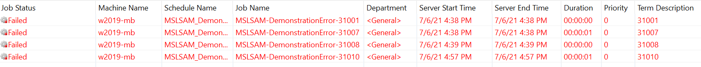
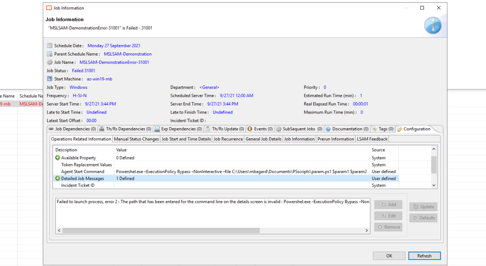
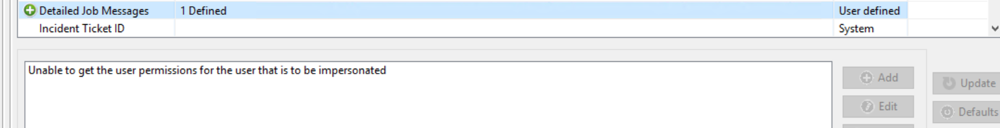

## Troubleshooting Common Windows Job Issues

In this article, we'll focus on the Windows LSAM **"MSLSAM"** and review the most common issues and how to troubleshoot efficiently.

**Understand the issue**

It's easy to understand why an **MSLSAM** is not able to start a job thanks to the Exit Code returned by the agent when something is going wrong.

Every job submission failed for the Windows LSAM start by **310** and are followed by 2 numbers like 31007, 31010, etc.

If the exit code is different than **310xx** and if your Windows Job is not a File Arrival, then it's most likely an issue with the program started/task executed by the job.

**Troubleshooting**

Once you've identified a 310xx type issue, the easiest way to get a quick information about the error code is from the Job Information with a **right-click** on your **failed job > Configuration > Detailed Job Messages**:

The previous example displays a detailed message for the error code **31001**. This is basically the information provided in the **online documentation** for the code **31001**.

Another interesting thing that you can find in the Job Information is the command line submitted by OpCon to the machine:

You can then check what OpCon exactly sent to the machine and review for typo or mistakes in the command line. Here, we can see **"Powershel.exe"** instead of "**Powershell.exe"**. At the same place, you can also find the **Token Replacement Values** where you can see the values of the properties used in your job.

As a second example, the error 31008 may display this kind of message reflecting that you've an issue with your batch user (username error, inexistent or wrong password).

**How to solve 310xx issue?**

To solve this type of error, you can first check the Job Information to understand the issue and if needed the following check-list to review your job and environment to make sure that everything is correct:

* Is the primary machine used the correct one?

* **Is the user id correct**:

* correct name?

* correct password?

* Does the user exist on the target machine?

* Does the user have the rights to execute the job or access the file/program?

* Is the prerun correct?

* Is the working directory of the prerun correct?

* Is the command line of the job correct?

* Is the working directory correct?

* Is the Run In Command Shell enabled?