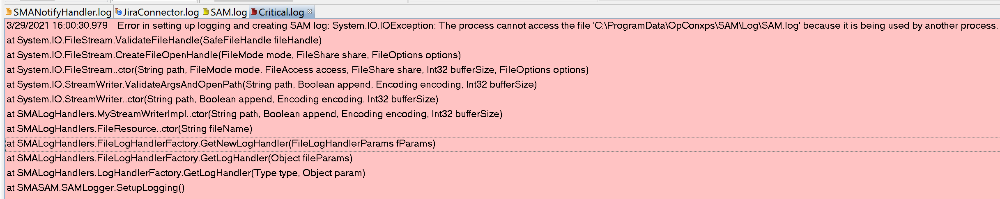
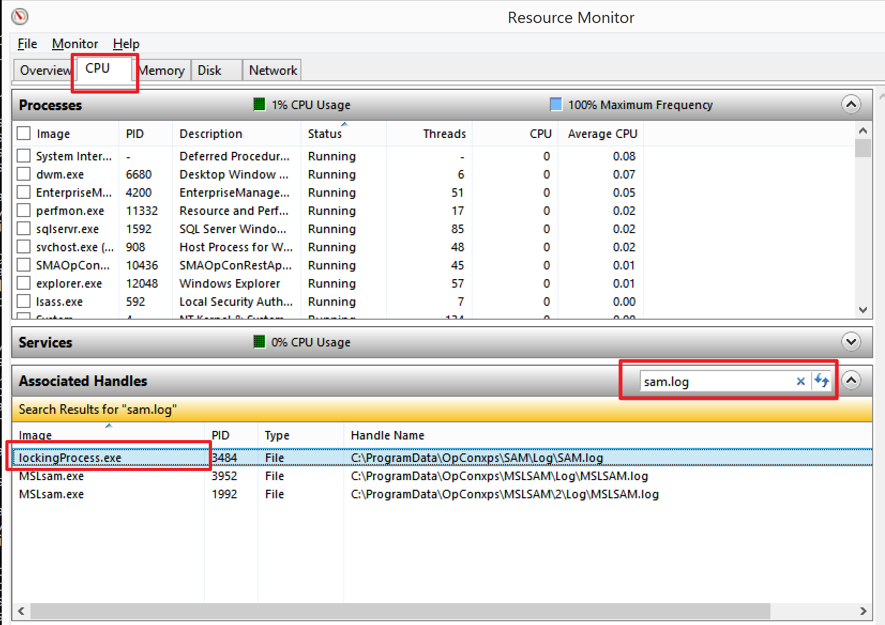
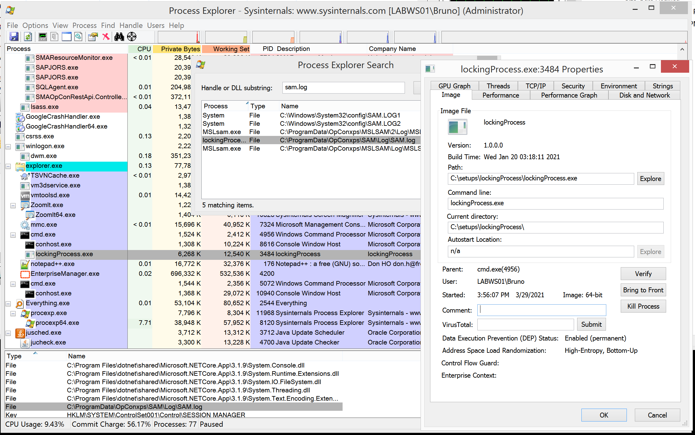
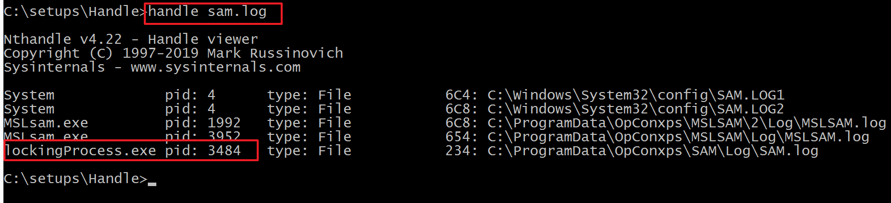

## Troubleshooting OpCon Files Locked

**What is the issue?**

You may encounter situation where **OpCon** or an **LSAM** is not working because a file such as a log or tracking file is locked or used by another process.

For example in the picture below, the **SAM.exe** is not able to start because **SAM.log** is blocked by another process:

The most common issues we're encountering are the following:

* "... File in Use. The action can’t be completed because the file is open in another program....."
* ".....The process XYZ cannot access the file abc.log because it is being used by another process....."

**Where to look**

* The LSAM log if this is happening on a Machine (MSLSAM.log, SQLAgent.log, etc.)

* In the SMAServMan.log to identify the process affected (you'll see here which process is going down)

* OpCon Critical.log can provide information too
* Windows event viewer (application) can also display useful information

**How to solve it?**

To address the situation quickly and efficiently, it is important to find out what is locking the file (most of the time it is the **antivirus program**). Once the culprit is found you can take the appropriate mesure in order to solve the problem. **Closing the application** holding the file is enough. However, if OpCon or the LSAM is not able to recover or is already down, **you may have to perform a start or a restart**.

There are different tools (OS, Microsoft, third parties) useful for the purpose, some of them are already present in the Windows OS, some are from Microsoft and some are from third parties.

Let's take a look to few of them (only from Microsoft) and choose your favorite:

* **Resource Monitor** - already installed on Windows
* **ProcessExplorer** - available on Microsoft website
* **Handle** - available on Microsoft website

**1. Resource Monitor**

The main advantage of the Resource Monitor is that is already installed on your server, no need to download a tool.

* To launch Resource Monitor, press WinKey + R, type resmon.exe and press ENTER
* Select the CPU tab, and expand Associated Handles bar
* Type a file name or part of the file name in the text box provided. This should list the processes which are currently accessing the file(s)

**2. ProcessExplorer**

The main advantage of the ProcessExplorer is we've more information about the process blocking the file.

* Download from https://docs.microsoft.com/en-us/sysinternals/downloads/process-explorer
* Click on Find->Find Handle or DLL.
* Type the name of the locked file in the search dialog
* Click the Search button.

**3. Handle.exe**

The advantage of Handle.exe is that the result is immediate and it's a command line version of the ProcessExplorer.

* Download from: https://docs.microsoft.com/en-us/sysinternals/downloads/handle
* Execute from command line: handle `<name of the locked file>`

