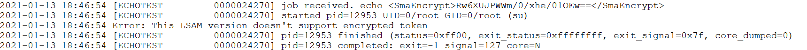
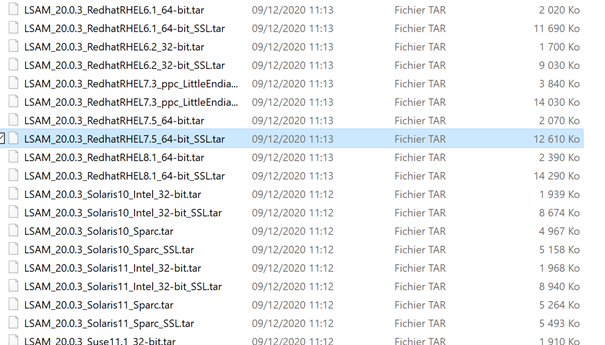

## UNIX Error: << This LSAM Version Does Not Support Encrypted Token >>

With **OpCon**, you've the possibility to use encrypted global properties in your Unix jobs. But you may encounter an issue if you're using the wrong agent version.

**What is the issue? **

If you're using an **encrypted global property** in your job and it fails with an **exit code 127**, then check the log file to see if this is an issue with the agent version.

If the **logfile** of your job contains the message *"Error: This LSAM Version doesn't support encrypted token"*, the LSAM version used is not handling encrypted token. 

**How to solve this?**

You must use an **SSL** version of the LSAM for the install. (The .tar file to use must contains `« *_SSL.tar »`).

For exemple: LSAM_20.0.3_RedhatRHEL7.5_64-bit_**SSL**.tar (instead of LSAM_20.0.3_RedhatRHEL7.5_64-bit.tar)

