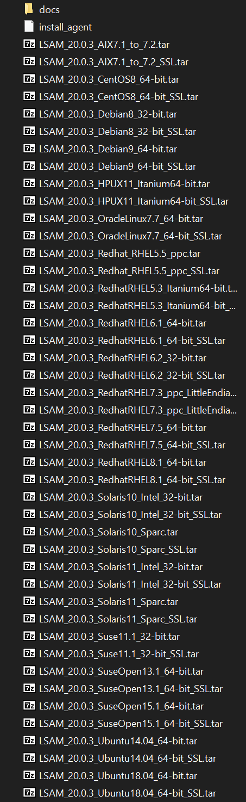

## UNIX LSAM Choosing The Right Tar File to Install

The UNIX LSAM can be installed by a tar file and a sh script install_agent but which tar to use!?
With this article you should be able to know which tar file you have to install on your UNIX environment.
The screenshot below show all tar files available for the version 20.0.3 of the agent and is used as an example. You'll find the same structure on other versions:

Below a legend of what you can find and how to interpret it:

* **SSL**: It allows TLS communication between the OpCon server and the agent, moreover it also allows to decrypt the global properties if you are using this feature.

* **64**: It indicates this tar file is for 64bits systems only

* **32**: It doesn't allow to decrypt global properties, if nothing is specified it's a 32bits agent.

* **Intel**: Server on an Intel architecture

* **Sparc**: Server installed on a Sparc architecture

* **ppc**: Server installed on a Power system (IBMi)

* **Itanium**: Server installed on an Itanium architecture

For some systems like **Ubuntu** if the tar file for Ubuntu doesn't work, you may have to install the tar file for **Debian** (Ubuntu is a linux distribution based on Debian distribution), it also the same for **CentOS** or **Oracle Linux** you may have to use a tar file for **RedHat** (CentOS is a linux distribution based on RHEL systems)

**How to choose a version?**

tar files usually show the version of the system where the tar file was compiled, you have to take the tar file which corresponds to your system version, your system version can be the exact same version or a higher version **but never a lower version**.
For example for this tar file `LSAM_20.0.3_RedhatRHEL7.5_64-bit.tar`, this agent is compatible with all **Red Hat systems version 7.5 and higher** if the version is a higher version like 8.2, take `LSAM_20.0.3_RedhatRHEL8.1_64-bit_SSL.tar`

:::warning

Be careful! Using the wrong .tar file may damage your instance or create dysfunction!

:::