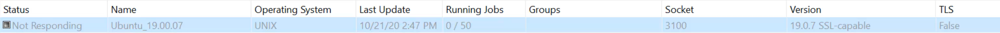
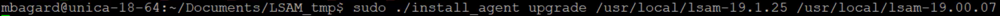
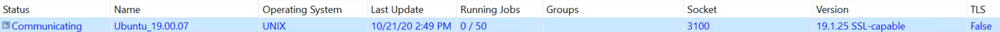

## UNIX LSAM Upgrade

**How to Upgrade Unix LSAM?**

Learn how to keep your **UNIX LSAM** up to date by upgrading your existing instance. 

What you'll need for this: 

* the latest release of the LSAM .tar file*

* the install_agent script

* an access to the UNIX machine 

* your **Enterprise Manager**

*Please select the .tar file matching the version of your Operating System (RHEL, Ubuntu, Debian,...) Using the wrong .tar file may damage your instance!*

If you don't know which .tar to use, please review this article: **UNIX LSAM choosing the right tar file to install**

**First step**

Make sure that your LSAM is not currently running jobs, you can check the amount of running jobs in **Operation > Machines Status**

If nothing is currently running on your machine, then you can stop the communication between OpCon and the LSAM: **right-click on the machine > Stop Communication**

The status of the machine is now "Not Responding". 

**Second step**

Send both **install_agent** script and your .tar file into an empty temporary folder on your UNIX machine.

You may have to add the **execution permission** on the **install_agent** script:

`chmod +x install_agent`

**Third step**

Now we'll engage the upgrade process using the following command structure:

`./install_agent upgrade /new_lsam_folder /old_lsam_folder`

Let's say the **lsam** is installed under `/usr/local/lsam-19.00.07` and we want to upgrade it to the version 19.1.25, then the command will looks like:

`./install_agent /usr/local/lsam-19.1.25 /usr/local/lsam-19.00.07`

What the install_agent do:

* stop the running LSAM before the upgrade process

* copy the configuration to the new LSAM folder we've specified for the upgrade (lsam-19.1.25 in our example)

* copy the cronmon.conf and the SMA_RM.conf (if they exist)

* copy everything under fad/

* finally, the script upgrade the agent 

* **for safety purpose, the old lsam folder will remain if a rollback is needed**

The upgrade can take several minutes to complete, once it's done, you'll see under your install repository the old and the new lsam folders. 

**Last step**

Go back to your Enterprise Manager "Machine Status" and start the communication with a right-click "Start Communication". The status will turn into "Communicating" and after a moment the Version column will be updated.

