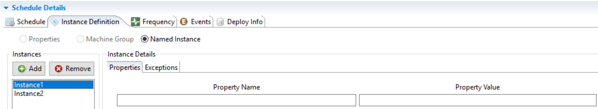
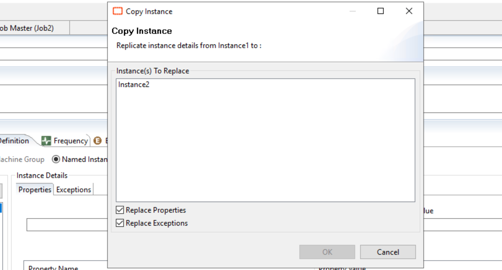
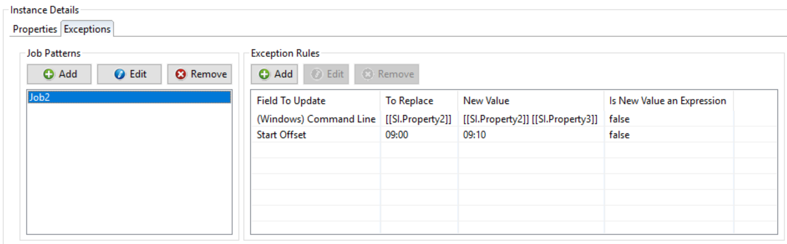
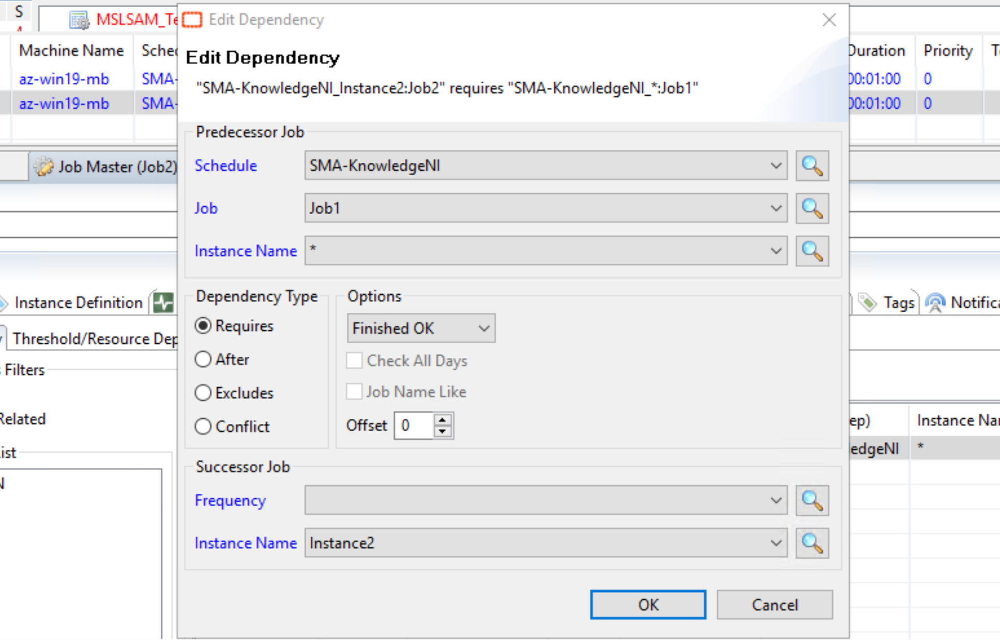
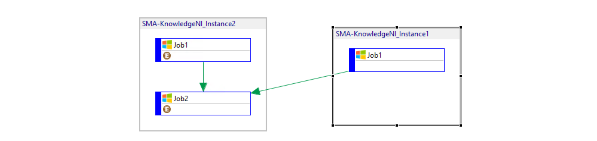

## Use Named Schedule Instances

Multi-instance support for schedules in OpCon is a powerful feature that reduces the maintenance burden on repeatable workflows. Essentially, a single definition rule can be designated for unlimited use or job runs.

**Named Schedule Instance** functionality expands multi-instance capabilities on schedules to include exception management and inter-instance dependency capability.

In this article, we'll see how to create a Multi-Instance schedule using Named Instances and what is possible to perform with this kind of schedule.

**What are they used for?**

* Simpler management of instances
* Different instances properties
* Different parameters possible for each instance jobs (machine, command line, start offset, etc)
* Cross schedules dependencies

**Create the Schedule**

The first step is similar to the creation of every schedule. Go to **"Schedule Master"** and create a new schedule. Select **"Multi-Instance"** in the Schedule Properties and save the modification.

In the next step, you need to select your multi-instance option. In the **"Instance Definition"** panel, select **"Named Instance"**.

Following this choice, the current panel will change and display more options:

You can see now three new components:

* **Instances**: where you can define an instance
* **Properties**: where you can declare your properties - tied to the instance
* **Exceptions**: where you can declare exceptions - tied to the instance

Each instance can contain a different amount of **properties** and **exceptions** and are independents. An **exception** allow you to modify an attribute of a job such as the command line or the primary machine, etc. **Exceptions** can be applied to a single job or to a list of job corresponding to a defined pattern.

**Instances**

The left panel is used to define your instances. You can create, add and remove an instance from here.
You can copy an Instance to another one by double-clicking on it:

**Exceptions**

As Properties are similar to other schedules, we'll directly look at the particularity of **Named Instances: exceptions**.

Exceptions allow you to define specific rules for your instance. This is one of the true power of the named instances where you can bring more flexibility and have instances behaving differently (different machine, start time, command line, etc.)

In the following example, the Job2 is modified with two rules that change the command line and the start offset. If I wanted to target the two jobs of my schedule (Job1 and Job2), I would have set "Job*" or "*" in the Job Pattern.

More information here: [Named Instances](https://help.smatechnologies.com/opcon/core/automation-concepts/named-schedule-instances)

**Dependencies**

Another powerful feature provided by the Named Instances are the **cross dependencies**. You can now set up a cross dependency between two instances. You just need to specify the "Predecessor Job" : the one you're targeting with the dependency and the "Successor Job" where is set the dependency. In this example, I created a dependency on Job 2 of Instance 2 (successor) depending on the Finished Ok status of Job1 from all instances.

And the dependencies in the Pert view of the daily schedule:

