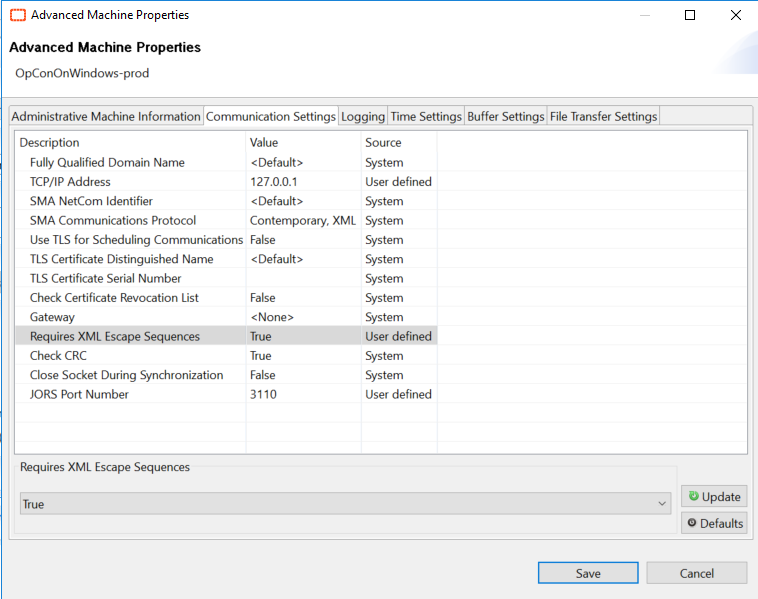

## Windows Job Failed With Encrypted Global Property

**What is the issue? **

A windows job is failed with an exit code **-1** and an error **"System.ArgumentException: Column 'F_Text' does not belong to table F"** in the mslsam.log file.
How to solve this? 

Go to the **Enterprise Manager > Machines**, select the machine of your job, put down the communication, open **advanced settings** and the **communication settings** tabs: 

Set **« Requires XML Escape Sequences »** to true. Update and save the modification and finally start the communication with the machine and restart your job. 

